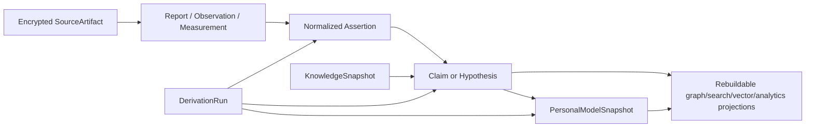
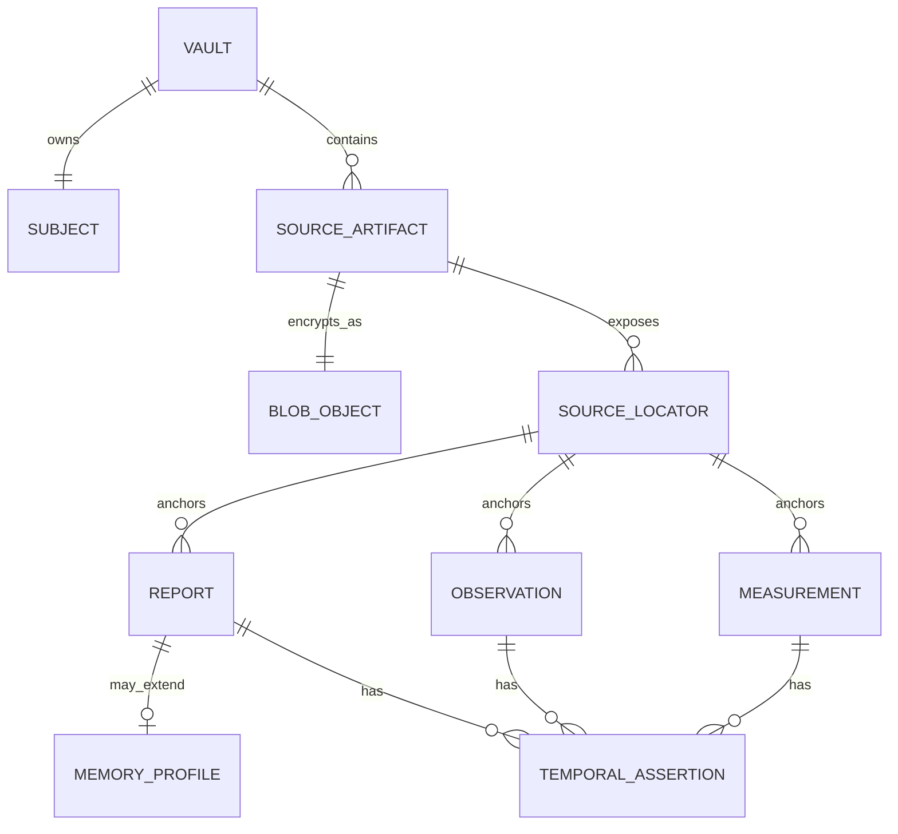
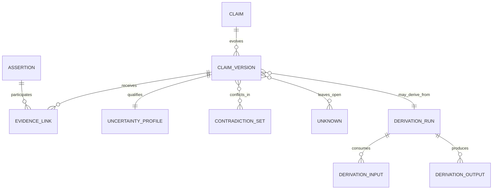

# PSYCHE OS v2 data model

**Status:** normative research design  
**Snapshot:** 2026-08-10  
**Canonical store:** local encrypted relational database plus encrypted source objects  
**Real data:** prohibited until the gate opens

## 1. Design goals

The data model must preserve the difference between what was supplied, what was reported, what was observed, what was computed and what is currently believed. It must support uncertain and conflicting time, correction without silent rewriting, hard deletion through all reconstructive derivatives, reproducible model/knowledge versions, and an open export that remains understandable without a current LLM or provider [ARCH-041–ARCH-048].

The canonical model is relational. A graph is a projection of typed relational edges; a graph visualization does not require a graph database.

## 2. Global conventions

### 2.1 Identifiers

- Every canonical aggregate has an opaque random 128-bit `record_id`; the external string form is UUID-compatible but generation does not encode content, time, person or source.
- Every immutable version has its own `version_id`.
- Blob filenames are opaque random IDs. Plaintext hashes never become paths or externally visible identifiers.
- IDs are stable across correction and export. Imports retain foreign identifiers in a scoped `ExternalIdentifier`, never as primary keys.
- A single-user vault still has an explicit `vault_id` and `owner_subject_id`; this prevents accidental assumptions when imports or future profiles are considered.

### 2.2 Version rows

Mutable semantic records are versioned, not overwritten. Each version contains:

```text
record_id
version_id
schema_version
transaction_from
transaction_to?        # half-open; null means currently active
change_reason_code
supersedes_version_id?
created_by_actor_id
derivation_id?         # absent for direct user/source records
```

Closing an active transaction interval and inserting a new version is atomic. Historical versions are visible only in a deliberate history view. Correction, supersession, rejection, invalidation and deletion are distinct operations.

### 2.3 No generic “truth” flag

The model has no universal `is_true`, `confidence` or `verified`. Status and uncertainty are type-specific. A claim can be supported, contradicted, contested and uncertain simultaneously. A source artefact can be authentic as a file while a statement inside it is false. A memory can be sincerely reported and historically uncertain.

### 2.4 Schema semantics

- Enumerations use stable machine IDs and localized labels outside canonical rows.
- Units follow UCUM-compatible codes where possible; original units and conversion provenance are retained.
- Decimal quantities are stored without binary floating-point surprises when exact scoring or money-like precision matters.
- Free text is UTF-8 and language-tagged; normalized text never replaces verbatim text.
- `null` means absent under a documented field rule. Epistemic unknowns use explicit `Unknown` records or `unknown_reason`, not ambiguous nulls.
- All serialized contracts have a semantic version, JSON Schema 2020-12 definition and migration/compatibility policy [ARCH-042].

## 3. Canonical layers



The arrows are derivation/provenance, not a compulsory linear ladder. A report may support several competing assertions; a measurement may directly support or contradict a claim; a model snapshot may contain unresolved unknowns.

## 4. Source and evidence aggregates

### 4.1 `SourceArtifact`

Represents an imported or created source unit: document, image, audio, message export, form, note or sensor file.

Required fields: `record_id`, active version, `artifact_kind`, `origin_kind`, `captured_at`, `source_actor_id`, `language_tags`, `blob_id`, original filename stored encrypted, declared/observed MIME types, byte size, parser state, quarantine state, privacy policy assignment, and rights/ownership note.

An artifact is byte-immutable. A corrected artefact is a new artefact linked by `replaces` or `is_corrected_copy_of`. Parser/OCR/extraction results are derived records tied to parser/version/configuration. Source bytes can be hard-deleted.

### 4.2 `BlobObject`

Required envelope metadata: opaque `blob_id`, cipher suite/version, key version, nonce, authenticated metadata version, ciphertext length, storage locator, creation time and integrity state. Plaintext digest, if needed for local duplicate detection, is keyed or encrypted. No plaintext is stored in database pages, filenames, thumbnails or ordinary logs.

### 4.3 `SourceLocator`

Identifies a non-mutating range inside an artefact: page/paragraph, timestamp range, message ID, cell/range or byte-safe extractor locator. It includes extractor/version and must not rely only on a fragile character offset.

### 4.4 `Report`

A statement attributed to an actor at a reported time. Fields include `report_kind`, verbatim content/blob locator, reporter, subject references, perspective (`first_person`, `third_party`, `document_author`, `unknown`), language, elicitation method, and temporal assertions. `report_kind` includes `autobiographical_memory`, `current_state`, `event_account`, `belief`, `goal`, `value`, `preference`, `symptom_report`, `collateral_report`, and `other`.

### 4.5 `MemoryProfile`

An extension for autobiographical reports. It stores separate ordinal/unknown dimensions:

- subjective belief that the memory corresponds to an event;
- vividness;
- temporal precision;
- source attribution clarity;
- sensory detail;
- emotional intensity at report time;
- independent corroboration state;
- conflict state;
- elicitation/suggestion risk.

None is converted into an accuracy probability. A later change creates a new version; the initial verbatim report remains unless deleted.

### 4.6 `Observation`

A bounded observation with observer, subject, construct/phenomenon, value or coded state, method, context, observation time, quality flags and source. It does not imply explanation. `self_observation`, `external_observation`, `device_observation` and `clinician_observation` remain distinguishable.

### 4.7 `Measurement`

A value produced under a named `MeasurementProtocolVersion`: quantity/category, unit, resolution, device/instrument, calibration/algorithm version, raw reference, observed window, missingness/quality flags and derivation. Sensor output is evidence about a measurement process, not automatically the psychological construct it purports to proxy.



## 5. Time model

### 5.1 `TemporalAssertion`

Time is an assertion with provenance. Required fields:

- `temporal_role`: `occurred`, `observed`, `reported`, `recorded`, `asserted`, `effective`, `scheduled`;
- `value_kind`: `instant`, `closed_interval`, `open_interval`, `calendar_period`, `recurring`, `unknown`;
- lower/upper values and inclusive/exclusive semantics;
- `precision`: second/minute/hour/day/month/season/year/life_period/unknown;
- original literal (encrypted text where sensitive);
- time zone and whether known/assumed;
- calendar;
- source and assertion actor;
- `certainty_class` and rationale, without false numeric probability;
- relation to conflicting/superseded assertions.

An approximate “summer 2008” is an interval with seasonal/calendar semantics, not `2008-07-01T00:00:00Z`. Queries must choose the temporal role explicitly. Sorting a mixed timeline defaults to a documented display interval and shows uncertainty.

### 5.2 Transaction history

Domain time and database transaction time are orthogonal. A memory reported in 2026 about an uncertain 2008 event and corrected in 2028 contains at least occurred, reported and transaction-version intervals. Historical “as known then” queries use transaction time; event chronology uses an explicitly selected domain time.

## 6. Assertions, claims and evidence

### 6.1 `Assertion`

A normalized, source-near statement with subject, predicate, object/value, qualifiers, negation, modality, scope and source locator. It is not automatically believed. Normalization records the transformation and the original report remains accessible.

### 6.2 `Claim`

`ClaimVersion` fields include:

- `claim_type`: `descriptive`, `pattern`, `interpretive`, `narrative`, `statistical_association`, `causal_hypothesis`, `prediction`, `clinical_mapping`, `trait_estimate`, `functioning_assessment`, `strength_or_resource`, `recommendation_candidate`;
- typed proposition and human-readable bounded wording;
- population/scope/window/context;
- status: `proposed`, `user_accepted`, `active`, `contested`, `rejected`, `superseded`, `withdrawn`, `invalidated`;
- origin: user, deterministic rule, statistical analysis, clinician import, LLM proposal, mixed;
- derivation and knowledge snapshot;
- uncertainty profile;
- falsification criteria and review trigger;
- alternatives and counterfactual cautions where relevant.

Acceptance means “the user accepts this as a current working representation,” not proof.

### 6.3 `EvidenceLink`

A typed link from evidence/claim to a target claim:

- relation: `supports`, `contradicts`, `qualifies`, `contextualizes`, `duplicates`, `is_alternative_to`, `fails_to_support`, `cannot_discriminate`;
- directness: direct / indirect / derived;
- source-independence group;
- scope match and temporal match;
- strength class and rationale;
- author/algorithm and derivation;
- active version interval.

No universal numeric evidence tier collapses authenticity, relevance, independence, measurement quality and external validity. Source appraisal keeps these axes separate.

### 6.4 `UncertaintyProfile`

Stores named dimensions as `low/moderate/high/unknown/not_applicable` plus rationale and optional method-specific intervals:

- source reliability/authenticity;
- measurement error/reliability;
- construct validity;
- temporal uncertainty;
- interpretation ambiguity;
- model/parameter uncertainty;
- confounding/causal identification;
- external validity/population transfer;
- missingness and selection;
- rights/version uncertainty.

A validated numeric interval may be stored with estimand/method, but is not translated into a generic percentage confidence.

### 6.5 `ContradictionSet`

Groups mutually inconsistent assertions/claims with conflict type, scope, time, resolution status and resolution rationale. Resolution can be `unresolved`, `different_contexts`, `different_times`, `source_error`, `superseded`, `both_partly_hold`, `cannot_resolve`. The system never chooses a winner only because one statement is newer or model-generated.

### 6.6 `Unknown`

Represents a relevant unknown: question, scope, why it matters, knowledge state, attempts, what evidence could reduce it, whether asking would be burdensome/unsafe, and status. Reasons include `not_observed`, `not_asked`, `declined`, `forgotten`, `not_applicable`, `measurement_failed`, `source_unavailable`, `ambiguous`, `rights_blocked`.



## 7. Derivation and model snapshots

### 7.1 `DerivationRun`

An immutable execution record: method kind, code/rule/model/tool and versions, parameters/config digest, environment profile, start/end time, actor, purpose, input references, output references, validation outcomes, review state and failure reason. Sensitive prompt/output text is a separately encrypted artefact under lineage policy, never ordinary audit data.

LLM runs additionally name provider policy snapshot, model snapshot/alias, system contract version, disclosed record categories/IDs, redactions, structured-output schema and deterministic post-validations. An LLM output begins as `proposed`.

### 7.2 `PersonalModelSnapshot`

A snapshot is an immutable selection of active claims, contradictions, unknowns, domain summaries and evidence cut-off. It records:

- snapshot and schema version;
- evidence transaction cut-off and domain-time scope;
- knowledge snapshot and algorithms;
- included claim-version IDs and reason;
- excluded material and policy reason;
- unresolved contradictions/unknowns;
- previous snapshot and change summary;
- user review/acceptance status;
- generation derivation.

It is never updated in place. A diff describes added, removed, changed, weakened and newly conflicted claims without implying that the newest snapshot is truer merely by age.

## 8. Assessments and psychometrics

### 8.1 Knowledge-side `AssessmentDefinition`

Required: stable registry ID, title/abbreviation, construct and intended use, version, authors/publisher, item/content rights, scoring rights, permitted storage/display/export, official source, languages and translation status, target population, reference/norm sample, administration modes, recall period, item/response schema references, missing-item rules, deterministic scoring algorithm/version, reliability/validity evidence, measurement invariance, test-retest/repeated-use cautions, clinical cut-off limits, change indices if supported, review date and status.

No instrument becomes `approved` until rights, version, implementation and synthetic known-answer tests pass.

### 8.2 `AssessmentAdministration`

Required: definition/version, participant/subject, mode, language/translation version, started/completed times, intended purpose, context, responses (only where rights permit storage), missing/declined states, quality flags and privacy policy.

### 8.3 `ScoreResult`

Produced only by a deterministic scorer. Required: subscale/total, raw/transformed metric, algorithm, inputs, missingness decision, reference population, standard error/interval if justified, interpretation band and exact authorized wording reference. LLMs may explain an already computed result within the registered limits; they never calculate or invent cut-offs.

Repeated scores are not treated as change unless scale direction, version/language/mode comparability, measurement error, practice/reactivity, context and supported change threshold are addressed.

## 9. Longitudinal, sleep and N-of-1

### 9.1 `SamplingProtocol`

Defines construct, question/measurement, schedule type, randomization window, max prompts/day/week, burden ceiling, duration, pause/stop rules, context fields, missingness reasons, feedback policy, timezone/travel behavior and review trigger. It is user-approved and versioned.

### 9.2 `SleepEpisode`

Separates reported opportunity, estimated onset/offset, awakenings, perceived quality, device estimates, naps, schedule/context, substances/medication/illness and method. Device stages are stored as device-algorithm estimates, not polysomnographic truth. Derived regularity/duration metrics name window and missingness.

### 9.3 `ConfoundContext`

Stores non-diagnostic contextual candidates such as acute illness, pain, medication change, substance timing, travel/shift work, major life event or measurement change. It supports alternative explanations and safety routing; it never recommends medication changes or infers a medical diagnosis.

### 9.4 `ExperimentProtocol` and `ExperimentRun`

Protocol: question, target estimand, intervention/comparator, randomization/counterbalancing, unit, duration, washout/carryover, outcome, measurement validity, covariates, confound plan, missingness, analysis plan, multiplicity, minimum information/stopping rule, adverse-event/clinical stop rules and preregistration hash/time.

Run: protocol version, deviations, assignments, adherence, outcomes, adverse events, analysis derivation, exploratory versus confirmatory labels and conclusion. Recommendations are not generated from statistical significance alone.

## 10. Knowledge and classifications

### 10.1 `KnowledgeSource` and `KnowledgeSnapshot`

A knowledge source has citation, version/date, evidence type, population, limitations, currentness review, rights, retraction/correction state and local storage permission. A snapshot is an immutable manifest of exact source/ontology/instrument/algorithm versions used in a derivation.

### 10.2 `OntologyConcept` and `MappingAssertion`

Ontology concepts belong to a versioned scheme. Crosswalks are directional mapping assertions with relationship (`exact`, `narrower`, `broader`, `related`, `no_safe_mapping`), source, rights, confidence rationale and review date. ICD, DSM, RDoC, HiTOP, ICF, trait and wellbeing schemes remain layers; none is the canonical identity ontology.

## 11. Privacy, disclosure and audit

### 11.1 `DataPolicy`

Versioned fields:

- sensitivity;
- local/cloud policy and named allowed providers/purposes;
- third-party scope;
- retention and review policy;
- export/redaction rules;
- derived-lineage rule;
- legal/consent basis note where applicable;
- precedence and expiry.

The effective policy is computed by a deterministic engine before data reaches an adapter. The most restrictive parent applies unless an explicit, lawful declassification record passes policy validation; `NEVER_CLOUD` cannot be relaxed implicitly.

### 11.2 `DisclosureReceipt`

Stores purpose, destination/provider, dated provider-policy snapshot, user authorization reference, disclosed canonical IDs and categories, redaction/transformation IDs, timestamps, response retention decision and outcome. It excludes raw disclosed content, prompts, tokens and secrets.

### 11.3 `AuditEvent`

An append-only operational event with timestamp, actor, action code, target opaque ID/type, result, policy/rule version and correlation ID. It contains no note text, assessment responses, file names, prompt bodies, diagnoses, third-party names or deleted-content hashes. Audit retention is bounded and integrity-protected.

## 12. Correction, deletion and backups

### 12.1 Correction and supersession

- **Correction:** a prior value/source representation was erroneous; add a version and reason.
- **Supersession:** a later state/view replaces an earlier active view without asserting earlier error.
- **Rejection:** user/reviewer declines a proposal.
- **Invalidation:** inputs, method, rights or schema no longer justify a derived result.
- **Deletion:** remove content according to scope; not merely a status.

### 12.2 `DeletionRequest` and `DeletionReceipt`

The request names roots, scope (`record`, `source_and_derivatives`, `time_range`, `all_subject_data`, `vault`), backup policy and external-copy warnings. A dry run enumerates affected records by type without exposing content. Execution occurs in a transaction where possible, traverses derivation/evidence/snapshot/projection manifests, removes blobs and canonical records, invalidates aggregate outputs that also depend on retained inputs, rebuilds projections and schedules encrypted-backup expiry or key retirement.

The receipt records request ID, opaque root IDs or salted request-local references, counts by type, completion/failure, projection rebuild state, backup expiry horizon and known exclusions. It stores no content or stable content hash.

### 12.3 `BackupManifest`

Names vault/schema/app/key-wrap versions, package format, creation/cut-off time, encrypted entries, authenticated inventory/checksums, retention/expiry, recovery method and restore-test history. Backup destinations are not canonical facts. A backup is healthy only after an isolated synthetic restore and invariants check.

## 13. Projections

Projection manifests store type, schema/version, builder code/config digest, source transaction cut-off, source IDs/categories, effective privacy policy, creation and invalidation state. Projection types include:

- evidence graph;
- timeline index;
- full-text index;
- vector index;
- aggregate/statistical table;
- search cache;
- report/export;
- clinician/FHIR view.

Deleting or restricting an input invalidates every manifest containing that input or descendant. A projection may be dropped at any time without information loss.

## 14. Migration contract

Every migration is directional, versioned, checksummed and tested on synthetic old-version fixtures. It declares preconditions, forward transform, validation, rollback/restore strategy, data-loss risk, projection rebuilds, privacy/deletion effects and minimum compatible reader. Destructive transforms require a verified backup and export. The system keeps fixture readers for every released major export version or a documented conversion chain.

Migration success requires:

1. row/entity counts and invariant checks;
2. provenance/derivation closure;
3. temporal interval validity;
4. no dangling evidence or policy links;
5. deterministic known-answer assessment scores;
6. delete-and-rebuild proof;
7. export round-trip semantic equivalence;
8. restore from pre-migration backup;
9. no plaintext/temp/log leakage.

## 15. Required database invariants

1. At most one active semantic version per `record_id`.
2. Transaction intervals do not overlap for a record.
3. Every derived output has exactly one valid `DerivationRun`; every named input exists and is policy-compatible.
4. A source-near assertion has a `SourceLocator` or an explicit source-unavailable reason.
5. An active claim has at least one evidence link or is explicitly `unsupported_proposal`.
6. A causal claim requires a causal-design record; a diagnostic mapping requires qualified origin and boundary fields.
7. A score result references an approved instrument and deterministic algorithm version.
8. Privacy policy resolves before disclosure/export; `NEVER_CLOUD` ancestry yields `NEVER_CLOUD`.
9. No content field is accepted into `AuditEvent` or operational log schemas.
10. Deleted roots and reconstructive descendants do not appear in canonical queries or rebuilt projections.
11. A model snapshot is immutable and pins knowledge/evidence cut-offs.
12. Unknown/declined/missing/not-applicable are distinguishable.
13. Every blob referenced by canonical data authenticates; every unreferenced blob is quarantined for bounded garbage collection.
14. A restore that cannot validate manifests and schema does not replace the active vault.

## 16. F0 schema boundary

F0 implements only the irreversible/safety foundation: vault/subject/actor IDs; version rows; encrypted blob and source artefact; report/observation/assertion; temporal assertion; claim/evidence/uncertainty/contradiction/unknown; derivation; data policy/lineage; audit metadata; deletion; schema migration; export/backup manifests; knowledge source/snapshot skeleton. Assessment content, LLM adapters, graph/vector engines, wearables, rich UI, clinician/FHIR export, automated interventions and real personal data are excluded.

The exact implementation contract is in `docs/prompts/F0_IMPLEMENTATION_PROMPT.md`. This document defines semantics, not permission to implement beyond that prompt.
