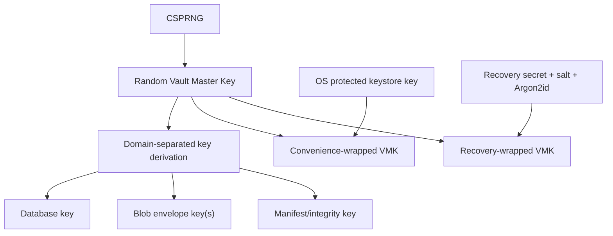

# PSYCHE OS v2 privacy and security model

**Status:** normative research design  
**Snapshot:** 2026-08-10  
**Security claim:** design requirements only; no implementation, penetration test or certification exists  
**REAL_DATA_GATE:** `CLOSED`

## 1. Protection objective

PSYCHE OS is designed for material whose disclosure, alteration, loss or misleading derivation could cause psychological, relational, employment, insurance, legal, reputational or physical harm. Security therefore covers confidentiality, integrity, availability/recoverability, deletion, provenance, purpose limitation and comprehensible user control. Privacy is about effects on people, not only encrypted bytes [ARCH-004–ARCH-009, ARCH-016–ARCH-019].

The model assumes one vault owner on a personally controlled device. It does not assume the device, OS account, imported files, cloud providers, dependencies, backups or LLM output are inherently trustworthy.

## 2. Assets and harm classes

Highest-value assets include:

- verbatim autobiographical reports and source artefacts;
- psychological/clinical observations, screen responses and inferences;
- sexual, trauma, abuse, relationship, substance, legal and financial context;
- names/content about third parties;
- temporal patterns that reveal routines, crises or locations;
- keys, recovery material and authenticated backup packages;
- provenance, contradictions and model history that can be weaponized out of context;
- provider disclosure receipts and policy history;
- scientific/license metadata necessary to interpret results.

Metadata can be deeply sensitive. Filenames, timestamps, graph edges, embeddings, search terms, crash dumps, thumbnails and access patterns can reveal content even when source text is encrypted.

## 3. Security assumptions and exclusions

### Assumed for the local profile

- the user controls the device and can maintain supported OS updates;
- the operating system supplies a cryptographic RNG and protected user keystore;
- the vault process can obtain a private application directory;
- pinned vetted cryptographic/database libraries work according to their documented interfaces;
- the user can preserve an independent recovery secret and at least one configured encrypted backup.

### Not solved by at-rest encryption

- malware or an attacker operating as the unlocked user;
- keylogging, screen capture, clipboard theft or shoulder surfing;
- coercion and compelled disclosure;
- physical acquisition while the vault is unlocked;
- vulnerabilities in the OS, firmware or hardware root of trust;
- copies the user has already exported or disclosed;
- availability after loss of both OS wrapping context and recovery secret.

These are residual risks, not reasons to omit encryption. Distribution to high-risk threat environments would require a separate deployment profile.

## 4. Data-policy model

### PS-01 — Orthogonal classification

Every canonical root has versioned fields for:

| Axis | Values / rule |
|---|---|
| Sensitivity | ordinary / sensitive / deeply_sensitive |
| Processing location | local_only / approved_cloud |
| Cloud policy | never_cloud / ask_each_time / named_purpose_and_provider |
| Purpose | explicit bounded identifier and expiry |
| Third-party scope | none / incidental / material |
| Retention | policy ID with review/expiry |
| Export | allow / redact / block / ask, by audience |
| Lineage | most_restrictive_parent by default |

UI presets compile into these fields; they are not a parallel source of truth. Missing or contradictory policy fails closed.

### PS-02 — Lineage

A derived item receives the strictest effective parent policy if it contains, summarizes, embeds, quotes, predicts from or otherwise materially reconstructs protected input. `NEVER_CLOUD` cannot be downgraded by model output, import metadata, broad user permission or a prompt. A deliberate declassification, if ever supported, is a typed local action with rationale, affected derivatives, preview and explicit authorization; some policy classes may constitutionally prohibit it.

### PS-03 — Least disclosure and receipts

Disclosure is built from approved canonical IDs only after policy resolution. The user sees destination, purpose, provider policy snapshot, record categories/IDs, redaction/transformation and expected retention before authorization. A request-scoped capability expires after the call. The local receipt stores facts, not raw prompt/response content.

## 5. Cryptographic envelope

### PS-04 — Algorithms and framing

Use a maintained cryptographic library; no custom primitive. Each envelope declares format version, algorithm, key version and authenticated metadata. Candidate modern AEAD profiles are selected at implementation review and must ensure unique nonces under each key [ARCH-023]. Database-page encryption uses a vetted SQLCipher build/profile if licensing, packaging and tests pass [ARCH-026]. Every non-database source/blob is independently AEAD-encrypted.

Cryptographic agility means versioned readers and migration—not a runtime menu of unsafe legacy algorithms. Unsupported or unauthenticated ciphertext is never silently accepted.

### PS-05 — Key hierarchy



The OS keystore protects normal unlock; a separate recovery-secret path protects against OS profile/device loss [ARCH-020–ARCH-025]. The two wrappers protect the same random master key. The recovery secret is never a database key, never logged and never silently synced.

### PS-06 — Key lifecycle

States: `generated → active → rotation_pending → retired_for_write → retained_for_read → destroyed`. Generation uses CSPRNG; keys are held only as long as needed, zeroized on a best-effort basis, never included in crash/core dumps, and never passed to parsers/renderers/LLMs. Rotation is staged and restartable with old read keys retained until every object verifies under the new version. Compromise response can retire a key and require re-encryption from a trusted state.

Loss/restore tests cover:

- OS wrapper works; recovery wrapper works independently;
- corrupt wrapper and wrong secret fail without data mutation;
- interrupted rotation resumes safely;
- retired keys cannot encrypt new data;
- destroyed backup-specific keys make targeted expired packages unreadable;
- no universal vendor backdoor or hidden escrow is assumed.

Argon2id parameters are stored with the wrapper, benchmarked on target hardware and reviewed as hardware changes [ARCH-022]. Password strength and recovery instructions are UX/security controls, not merely validation rules.

## 6. Local storage and session controls

### PS-07 — Files and temporary data

- Use an application-owned directory with restrictive owner permissions.
- Keep database, WAL/journal, shared memory, temp, blob staging, projections and backup staging inside the controlled encrypted boundary where supported [ARCH-027].
- Avoid plaintext thumbnails, OCR caches, autosave, previews, shell history and editor temp files.
- Use opaque paths; encrypt original filenames and plaintext duplicate fingerprints.
- Do not rely on `secure_delete` or filesystem overwrite to guarantee SSD erasure [ARCH-029].
- Disable/limit core dumps and content-bearing crash reports.
- Validate free space before write/rotation/migration to prevent partial failure.

### PS-08 — Unlock and process lifetime

Unlock is local and rate-limited without destructive lockout. The process minimizes key residency, clears inactivity sessions according to a user-understandable policy, and requires re-authentication for export, recovery-wrapper changes, bulk disclosure and vault deletion. Clipboard export is deliberate, warns for deeply sensitive content, and offers time-bounded clearing as best effort without promising OS-wide removal.

The system does not claim multi-user access control. A future shared device/profile or collaboration feature requires a new authorization architecture.

### PS-09 — Integrity and concurrency

Writes are transactional and version-checked. AEAD/authenticated manifests protect stored objects; database integrity checks, foreign-key/invariant checks and projection cut-offs detect inconsistency. Integrity failure stops writes and begins evidence-preserving recovery—never automatic destructive “repair”. The active vault is not replaced until a restored candidate validates.

## 7. Network and provider boundary

### PS-10 — Network default

F0 has no network listener and no provider adapter. Later network access is denied by default and isolated behind an adapter/capability interface. Imported URLs never auto-fetch. Update checks, telemetry, license activation and model calls may not become covert disclosure paths.

### PS-11 — Provider registry

Each provider policy snapshot records date, endpoints/features, training policy, abuse-log retention, application-state retention, cache, residency, ZDR/MAM eligibility/exceptions, subprocessors/third-party tools where known, deletion method, contract/account scope and next review. Provider documentation is time-sensitive. Current OpenAI API facts are registered as a snapshot, not converted into a permanent guarantee [ARCH-039, ARCH-040].

Provider-side conversation IDs, hosted files, vector stores, assistants/threads or long-term memory are disabled for sensitive workflows unless a future explicitly reviewed policy allows a specific non-canonical use. Default design sends a minimal self-contained call with persistence disabled where supported.

### PS-12 — Prompt/tool security

Policy/authorization occurs outside the model. System prompts contain no secrets. Model output is untrusted structured proposal. Tool actions require allowlisted typed schemas, semantic validation, least privilege, user-visible preview and, for external/destructive actions, explicit authorization. Imported/model text cannot grant capabilities [ARCH-031, ARCH-032].

## 8. Import and rendering boundary

### PS-13 — Quarantine

All imports are untrusted, including files exported by familiar services. Intake records size and opaque identity, then checks extension, magic/signature and allowlisted type. Archives have maximum compressed/uncompressed size, entry count, nesting depth, ratio and path normalization. Symlinks, traversal, device files, active content, macros and unsupported encryption are rejected or kept quarantined [ARCH-033, ARCH-034].

### PS-14 — Parser isolation

Parsers/renderers receive only a copy/stream of the quarantined object, no vault master key, no database write handle, no provider token and no network. Extraction output is size/depth bounded and schema-validated; parser/tool/version becomes provenance. HTML/Markdown/model text is escaped/sanitized contextually in future webviews [ARCH-036]. OCR and document instructions are quoted as content, never executed.

Malware scanning is an optional signal, not proof of safety. A new file format/parser requires fuzzing/corpus tests, dependency review and threat-model update.

## 9. Logs, audit and telemetry

### PS-15 — Content-free operational logs

Allowlisted fields only: event code, time, component/version, coarse duration/size bucket, opaque request correlation ID, result/error category and local build/schema version. Prohibited: personal/source text, filenames, paths revealing subject matter, assessment responses, search queries, prompts/outputs, model interpretations, identifiers of third parties, tokens/keys/secrets and stable content hashes [ARCH-035]. Logs are integrity-protected, bounded by size/time and user-deletable where legally/operationally appropriate.

### PS-16 — Audit is not shadow data

Audit events identify an action on opaque record/type and outcome. Deletion receipts contain counts/status and external/backup limitations, not deleted content or content hashes. Debug mode cannot relax the log/audit schema. External telemetry is off by default and, if ever introduced, receives its own disclosure preview, privacy assessment and opt-in.

## 10. Backup, recovery and preservation

### PS-17 — Backup properties

- create a consistent snapshot using supported database APIs [ARCH-028];
- encrypt/authenticate before the package leaves local controlled staging;
- inventory every encrypted entry and pin schema/app/key-wrap versions;
- provide independent recovery instructions without embedding the secret;
- use user-selected destinations and explicit retention/expiry;
- maintain at least one tested copy separate from the primary device before real data;
- never call a file a backup until restore is proven.

A BagIt-like inventory/checksum layout can aid completeness, but checksums without an authenticated envelope do not resist an attacker replacing both content and manifest [ARCH-046]. Open JSONL/schema/Markdown export is distinct from disaster-recovery backup and is also encrypted when sensitive.

### PS-18 — Restore safety

Restore never overwrites the active vault first. It authenticates into an isolated explicit target, validates manifest, versions, database and blob integrity, runs compatible migration dry-run, verifies domain/policy/derivation invariants and rebuilds projections. Only then may the user activate it. Failed restores preserve diagnostics without content and leave source packages unchanged.

Recovery drills test missing/corrupt package entries, wrong secret, old schema, interrupted migration, key rotation state, full disk and stale projection. Success and last-tested date appear prominently.

## 11. Correction, deletion and retention

### PS-19 — Correction

Correction adds a version and invalidates affected derivations. It does not overwrite a source artefact or falsely claim that an earlier report was never made. History views are deliberate and privacy-protected.

### PS-20 — Hard deletion graph

Deletion traverses canonical ownership, provenance, derivation, evidence, snapshot and projection manifests. Exclusive descendants are deleted; mixed descendants are invalidated/recomputed without the removed input. Search/vector/graph/cache/report copies are dropped/rebuilt. Orphaned encrypted blobs are garbage-collected after transactional verification.

Encrypted backups follow declared expiry or cryptographic erasure, with a maximum horizon shown before deletion. An immediate promise cannot include offline packages outside control, recipient copies or prior provider disclosures. A receipt states these limits.

### PS-21 — Retention

No “keep everything forever” default. Raw artefacts, derived claims, disclosure receipts, logs, quarantined failures, backups and exports have distinct user-visible policies. Expiry is reviewable and reversible before execution where safe. Legal hold is not invented for a personal product; if introduced in a regulated deployment, it requires explicit authority and transparency.

## 12. Supply chain and release security

### PS-22 — Dependencies and builds

- pin direct/transitive dependencies with hashes;
- generate and archive an SBOM for releases [ARCH-037, ARCH-038];
- review cryptographic/database/parser licenses and provenance;
- run vulnerability and secret scanning;
- use reproducible or attestable builds where practical;
- sign distributed artifacts and verify updates before install;
- prohibit auto-update from weakening schema/privacy gates;
- provide rollback/recovery for failed update without downgrading data protection.

Development fixtures remain synthetic. `.gitignore`, pre-commit/CI scanners and review prevent vaults, backups, environment files, keys, logs and personal exports from entering Git.

### PS-23 — Scientific and model supply chain

Ontologies, assessment definitions, translations, scoring algorithms, model/provider policies and safety resources are dependencies. Pin versions and rights, verify signatures/digests when available, monitor corrections/retractions and regression-test behavior. A model alias is not a stable scientific component; store the returned model/snapshot identifiers and evaluation version.

## 13. Incident readiness

### PS-24 — Local response lifecycle

Use NIST CSF 2.0 and SP 800-61 Rev.3 as adaptable guidance, not a compliance claim [ARCH-018, ARCH-055]. Prepare before release:

1. identify contact/ownership and severity criteria;
2. preserve content-minimized evidence;
3. stop disclosure/disable affected adapter or importer;
4. protect the original vault/package before investigation;
5. rotate compromised keys/tokens from a trusted device;
6. determine affected versions, records/categories, backups/providers and users;
7. restore/repair through validated paths;
8. communicate facts and uncertainty without overclaiming;
9. conduct root-cause and control updates;
10. assess legal notification with counsel if the product leaves household scope.

Security-relevant integrity or disclosure failures automatically close/regress the real-data gate until resolved and independently reviewed.

## 14. Verification gates

### PS-25 — Required automated/adversarial tests

- known-answer crypto envelope and nonce uniqueness/concurrency;
- wrong/corrupt wrapper, key rotation interruption and recovery-only restore;
- plaintext signature scans across database, WAL/temp, blobs, logs, crash files, packages and projections;
- policy property tests showing `NEVER_CLOUD` cannot leak through every derivative type;
- provider adapter tests proving context cannot be built before authorization;
- hostile imports: traversal, polyglot, spoofed MIME, decompression bomb, nested archive, active content, oversized OCR and indirect prompt injection;
- transactional failure/full-disk/power-interruption simulations;
- correction/deletion graph closure and projection rebuild;
- backup/restore corruption and pre-migration rollback;
- export schema validation and round trip;
- dependency/SBOM/license/secret checks;
- future webview XSS/CSP/IPC tests;
- content-free log/audit schema enforcement.

### PS-26 — Independent review

Before any real data: independent cryptographic/key/recovery review; threat-model review; import/parser review; privacy-lineage/deletion audit; backup restore witnessed from clean environment; legal/intended-use review appropriate to deployment; and user-understandable recovery/deletion usability test. Passing unit tests alone is insufficient.

## 15. Regulatory/privacy posture

Psychological and health-related inferences receive the most protective defaults whether or not a specific jurisdiction labels every item as health data. GDPR-grade minimization, purpose limitation, privacy by design/default, security, erasure, portability, DPIA-style risk assessment and transfer accounting are the design baseline [ARCH-004, ARCH-005].

On 2026-08-10 Moldova Law No. 133/2011 remains current; Law No. 195/2024 and Convention 108+ changes are scheduled for 2026-08-23 [ARCH-006–ARCH-009]. Recheck after commencement. A private household prototype, commercial service, research study, clinician workflow and cloud-enabled product have different roles/obligations. This document does not decide them.

## 16. Real-data gate

`REAL_DATA_GATE` stays `CLOSED` until every item below has dated evidence and no unresolved critical/high finding:

```yaml
REAL_DATA_GATE:
  status: CLOSED
  can_open_only_if:
    - encrypted_database_and_blob_profile_verified
    - key_rotation_and_independent_recovery_verified
    - encrypted_backup_and_clean_restore_verified
    - deletion_lineage_and_backup_expiry_verified
    - migration_and_export_round_trip_verified
    - no_plaintext_temp_log_crash_or_projection_leak_verified
    - NEVER_CLOUD_property_tests_pass
    - hostile_import_boundary_verified
    - dependency_sbom_license_and_build_provenance_verified
    - threat_model_and_independent_security_review_pass
    - intended_use_privacy_and_legal_review_complete
    - synthetic_only_acceptance_suite_pass
```

Opening requires a versioned gate decision naming implementation/build, target OS/profile, tests, reviewer, residual risks and expiry/review date. Adding cloud, sync, mobile, sharing, clinician workflows or a new importer can close the gate again for that profile.

## 17. Residual risks

Endpoint compromise, coercion, inaccurate scientific/model output, user-authorized oversharing, third-party content, obscure parser vulnerabilities, SSD/file-system remnants, unavailable external copies, future cryptographic weakness and loss of all recovery material cannot be fully eliminated. The system must state these limits plainly and minimize blast radius rather than claim “military-grade”, “zero risk”, complete confidentiality or guaranteed deletion.
