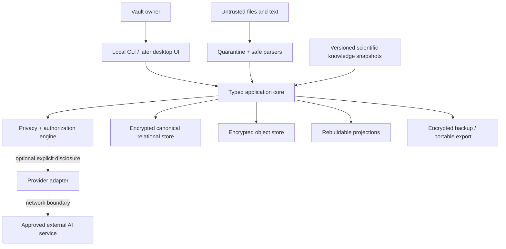
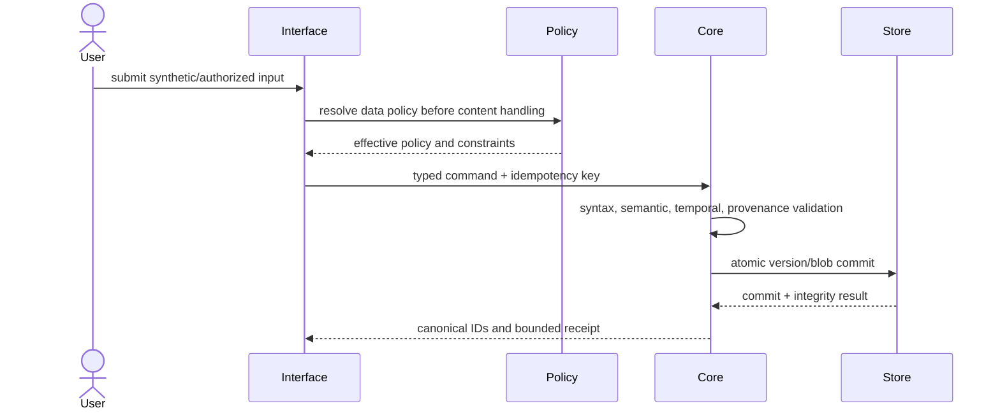

# PSYCHE OS v2 system architecture

**Status:** normative research design  
**Snapshot:** 2026-08-10  
**Selected architecture:** local-first modular monolith with a hybrid bitemporal relational canonical store  
**F0:** core/CLI only; no production application and no real data in the research phase

## 1. Architectural outcome

PSYCHE OS is a local personal evidence vault whose essential operations do not depend on an LLM, network, vendor subscription, graph database or proprietary file format. The canonical store is an encrypted relational database plus encrypted immutable source objects. Version rows, typed provenance and minimal content-free audit events preserve history; graph, timeline, full-text, vector, analytics, report and clinician views are disposable projections.

This is a single-user architecture, not a hidden multi-tenant SaaS. Future sync, collaboration or remote access would create new trust boundaries and require a new threat model and constitutional decision.

## 2. Quality attributes in priority order

1. Epistemic traceability and correction.
2. Confidentiality and least disclosure.
3. Recoverability and integrity.
4. Deletion and lineage invalidation.
5. Provider independence and offline use.
6. Open export and migration over decades.
7. Safety and bounded claims.
8. Comprehensible user control.
9. Testability and deterministic behavior.
10. Performance sufficient for one lifetime archive.

When these conflict, latency, model sophistication and engagement yield to the higher attributes.

## 3. Competing architectures considered

### A — State-oriented relational modular monolith

Current rows plus conventional history tables. It is simple, queryable and deletion-friendly but tends to lose explicit knowledge-time, derivation and “what was believed then” semantics unless rigorously extended.

### B — Full event-sourced temporal core

Every change is an immutable event and current state is replayed. It offers strong audit history, but deletion conflicts with immutable content, replay depends on every historical schema/handler, compaction is hazardous, and recovery/migration complexity accumulates across decades. Event completeness does not provide scientific truth.

### C — Hybrid bitemporal relational store with source objects, audit metadata and projections

Domain records have immutable versions and transaction intervals. Original artefacts are encrypted objects. Real domain events and content-free audit facts are appended. Typed derivations connect inputs/outputs. Secondary representations are rebuildable. This retains historical and provenance value while making ordinary queries, hard deletion and export tractable.

| Criterion | A | B | C selected |
|---|---:|---:|---:|
| Evidence/derivation history | 3 | 4 | 5 |
| Corrected “as-known-then” views | 3 | 5 | 5 |
| Hard deletion | 4 | 1 | 4 |
| Direct query and export | 5 | 2 | 5 |
| Schema evolution | 3 | 2 | 4 |
| Recovery without full replay | 5 | 1 | 5 |
| Complexity | 5 | 1 | 3 |
| Projection/provider independence | 3 | 3 | 5 |

The independent reconstruction and red teams reached architecture C without requiring v1 compatibility. Details and adversarial corrections are in `docs/reviews/INDEPENDENT_REBUILD.md` and `docs/reviews/RED_TEAM_REPORT.md`.

## 4. Context and trust boundaries

Trust boundaries are: OS account/session; local process and storage; parser/renderer quarantine; removable or synchronized backup destination; external provider/network; imported third-party material; scientific/license supply chain; future desktop webview/IPC. At-rest encryption does not protect an unlocked compromised endpoint.

## 5. Module boundaries

| Module | Owns | Must not own |
|---|---|---|
| `domain` | entities, value objects, state transitions, invariants | database, UI, network, model SDK |
| `temporal` | fuzzy/multi-clock values and queries | fabricated instants, locale presentation |
| `provenance` | artefact/source locators, derivations, evidence links | truth adjudication |
| `policy` | data-policy composition, lineage, disclosure decisions | prompt wording or provider calls |
| `storage` | transactions, version repositories, encrypted database profile | domain inference |
| `crypto` | key envelope interfaces, AEAD/blob framing, rotation/recovery state | custom algorithms, UI secrets |
| `imports` | quarantine, sniffing, limits, safe extraction, preview | policy changes, tool execution, automatic URL fetch |
| `knowledge` | source/ontology/instrument snapshots and rights gates | personal evidence |
| `psychometrics` | registry and deterministic scoring | LLM scoring, unlicensed items |
| `analysis` | reproducible descriptive/statistical/N-of-1 runs | untyped “insights”, clinical verdicts |
| `modeling` | claim proposals and model snapshots | source evidence or silent acceptance |
| `safety` | high-risk interaction policies, test scenarios, resource registry | diagnosis, guaranteed crisis detection/rescue |
| `projections` | timeline/graph/search/vector/analytics rebuilds | canonical state |
| `backup_export` | manifests, encrypted packages, open export and restore | hidden proprietary-only archives |
| `adapters` | OS keystore, filesystem, clocks, optional LLM/provider | domain semantics or policy bypass |
| `interfaces` | CLI and later typed desktop IPC/view models | direct database access |

Dependency direction is inward: interfaces/adapters depend on application contracts; application depends on domain; domain does not import infrastructure. Cross-module writes pass a typed application service and one transaction boundary.

## 6. F0 deployment profile

F0 runs as a local command-line process with:

- Python 3.12+ and a pinned, hashed dependency lock;
- no HTTP server, browser origin, remote access or background cloud worker;
- an application-owned vault directory with restrictive permissions;
- SQLCipher candidate database profile, subject to packaging/license proof [ARCH-026];
- encrypted per-object blob envelopes;
- OS-keystore adapter plus independent recovery wrap;
- synthetic fixtures only;
- deterministic UTC-capable injected clock and randomness interfaces for tests;
- JSON Schema export contracts and research validation commands.

A later desktop application should use a narrow typed IPC boundary (for example Tauri-class shell after separate review), restrictive content security policy, contextual encoding and no direct webview access to vault paths/keys. A localhost API is not the default because it adds origin, port, authentication and cross-process attack surface.

## 7. Canonical persistence

The relational database contains structured canonical records, versions, provenance, policy and metadata. Large/verbatim artefacts are per-object encrypted. The database contains only opaque blob references and authenticated envelope metadata. The database and blobs share a transaction/recovery protocol: a prepared blob is not made canonical until the database commit succeeds; orphan cleanup is bounded and never guesses from filenames.

Relational state is the authority. Audit events cannot reconstruct deleted content. Projections declare their source cut-off and builder version and can be deleted/rebuilt. The data semantics are specified in `docs/architecture/DATA_MODEL.md`.

## 8. Core workflows

### 8.1 Local capture

No model is necessary. A normalization request, if later enabled, is a separate derivation; its proposal cannot overwrite the report.

### 8.2 Import

`intake → quarantine → extension/signature/MIME comparison → byte/entry/depth/ratio limits → safe parser without network/vault keys → extracted artefact with parser provenance → human preview → policy assignment → canonical commit`.

The import is idempotent by an internal keyed/encrypted duplicate fingerprint and explicit user decision. Duplicate detection never exposes a plaintext hash. Unsupported or suspicious files remain quarantined and do not enter model context [ARCH-031–ARCH-036].

### 8.3 Optional LLM proposal

1. The user names a purpose and action.
2. The application constructs candidate canonical IDs, not raw prompt text.
3. The policy engine rejects prohibited lineage and calculates minimum disclosure.
4. The UI shows categories/records, redactions, provider and current policy snapshot.
5. Explicit authorization creates a request-scoped capability.
6. The adapter builds context from approved IDs, sets storage/cache controls where supported, and records a content-free receipt [ARCH-039, ARCH-040].
7. Structured output is validated for schema, evidence references, policy, contradiction and safety.
8. Output is stored as `proposed`; the user may accept, edit, reject or discard it.

Provider errors leave canonical state intact. Network loss disables the adapter, not capture, search, export, correction or deletion.

### 8.4 Correction

A typed correction command validates target/current version, appends a corrected version, closes the old transaction interval, records reason, invalidates dependent proposals/projections, and creates a content-free audit event. It never rewrites the source artefact. Concurrent stale writes fail with a version conflict.

### 8.5 Deletion

1. Resolve scope and show a dry-run count by type.
2. Warn about external copies and declared backup expiry.
3. Traverse source, derivation, evidence, snapshot and projection manifests.
4. Delete target canonical content and blobs; delete reconstructive descendants; invalidate mixed descendants.
5. Rebuild/drop affected projections.
6. Schedule backup expiry/key retirement and write a content-free receipt.
7. Verify by canonical queries, raw file scan, rebuilt projections and export.

The system never claims immediate erasure from previously exported/cloud copies it does not control.

### 8.6 Backup and restore

Backup uses a supported consistent database snapshot [ARCH-028], encrypts/authenticates the package before it crosses the vault boundary, and includes manifests/schema/app/key versions. Restore occurs into a new isolated vault path: authenticate → unwrap → verify inventory → schema compatibility/migration dry-run → invariant validation → projection rebuild → user confirmation → atomic activation. The old vault remains until the new one passes. Synthetic restore is automated; periodic manual recovery tests are required.

### 8.7 Migration

Migration requires a verified backup and open export, dry-run report, versioned transform, invariant/dangling-link/policy/deletion tests, projection rebuild and rollback/restore exercise. Old schema fixtures remain in tests. No migration silently downgrades a privacy policy, changes score semantics or invents temporal precision.

## 9. Security architecture

The key envelope, local permissions, logs, import isolation, backup, deletion and incident posture are specified in `docs/architecture/PRIVACY_SECURITY_MODEL.md`; attacker stories and severity are in `docs/architecture/THREAT_MODEL.md`. Essential rules:

- authenticated encryption and unique nonces;
- no secrets or content in prompts, code, Git, telemetry, audit or crash dumps;
- least-privilege process boundaries;
- dependency locks, SBOM, provenance and signed release path [ARCH-037, ARCH-038];
- fail closed on policy/crypto/schema uncertainty;
- recovery does not overwrite a healthy vault before validation;
- imported/model text never becomes authority;
- security features are tested through failure and adversarial fixtures, not existence checks.

## 10. Scientific architecture

The `KnowledgeStore` is logically separate from personal data. Every ontology mapping, assessment, algorithm, evidence summary and safety policy belongs to a dated `KnowledgeSnapshot` with rights and review state. Personal claims pin the snapshot used. Updating knowledge never silently rewrites a historical personal model; it may generate an explicit reevaluation proposal and diff.

Clinical classification, research frameworks, traits, functioning, quality of life, values and thriving are separate layers. Deterministic assessment scoring is isolated from LLM interpretation. This protects scientific reproducibility and copyright/licensing boundaries.

## 11. Availability and graceful degradation

| Failure | Required behavior |
|---|---|
| No network/provider outage | All canonical local functions remain; cloud proposal disabled with reason. |
| Provider/model retired | Adapter disabled; historical derivations remain identifiable; alternate adapter can be evaluated. |
| Projection corrupt/stale | Drop and rebuild from canonical store; never promote projection to truth. |
| Parser failure | Preserve quarantined source and error metadata; no partial canonical inference. |
| Database integrity failure | Stop writes; preserve evidence; restore into isolated location; do not auto-repair destructively. |
| OS keystore unavailable | Offer documented recovery-wrap path; rate-limit locally without destroying data. |
| Recovery secret lost too | State irrecoverability honestly; no backdoor/master escrow is assumed. |
| Backup destination unavailable | Canonical local writes can continue with prominent bounded recovery warning, but real-data readiness can regress. |
| Knowledge source expired/retracted | Historical result remains reproducible and flagged; new use blocked or reviewed. |
| Safety resource stale/locale unknown | Avoid fabricated number; direct to verified local emergency path/general nearby human. |

## 12. Observability without surveillance

Metrics are local, off by default for external telemetry, and content-free: operation counts/duration buckets, error codes, schema versions, projection lag, backup/restore age, failed integrity checks, dependency/build identifiers and safety-policy version. Never log source text, assessment answers, filenames, search queries, prompts/responses, diagnoses, third-party names, key material or stable content hashes [ARCH-035].

Crash reporting requires a separate explicit privacy decision and a redacted allowlist. Debug mode may not weaken the canonical no-content log schema.

## 13. Lifetime horizon

### One year

Prove invariants, restore and export round trips; resist scope expansion. Measure burden with synthetic/usability studies, not real archive ingestion.

### Five years

Expect schema and model changes. Keep version readers, migrations, knowledge reevaluation and projection rebuilds routine. Audit licenses and provider policies.

### Twenty years

Assume current LLMs, UI frameworks, OS APIs and many integrations are obsolete. A documented relational snapshot plus open JSONL/schemas/Markdown export must reconstruct meaning. Replace adapters without transforming epistemic semantics.

### Forty years

Assume multiple hardware/media migrations and periods of non-use. Periodically verify encrypted backup recoverability and export readability. Preserve software-free human documentation, provenance, units, temporal precision and schema history. Do not depend on continuous subscription or live web resources.

## 14. Explicitly rejected or deferred

Rejected: full event sourcing; graph database as canonical store; content-addressed public blob names; cloud/server-first core; chat transcript as archive; LLM-only knowledge; autonomous diagnosis/therapy/triage; engagement optimization; universal daily tracking; hidden provider memory; one-dimensional privacy tier.

Deferred until after core proof: desktop shell, graph/vector engines, LLM adapters, wearables/messages/calendars, FHIR clinician export, advanced statistics/N-of-1 execution, intervention registry, sync/collaboration, mobile and any public/clinical distribution.

## 15. Architecture acceptance criteria

The architecture is acceptable for implementation research when:

- module dependency rules can be enforced by tests;
- every canonical transformation has typed provenance;
- cloud policy is enforced before context construction;
- synthetic correction/deletion/migration/export/restore tests cover all canonical entity kinds;
- provider and projection removal leaves a usable vault;
- no content reaches logs or audit schemas;
- source/assessment rights can block use;
- four adversarial audit suites pass;
- `REAL_DATA_GATE` remains closed until implemented controls receive independent review.

This research design marks `RESEARCH_CONVERGED = true`; it does not assert that any implementation exists or is secure.
