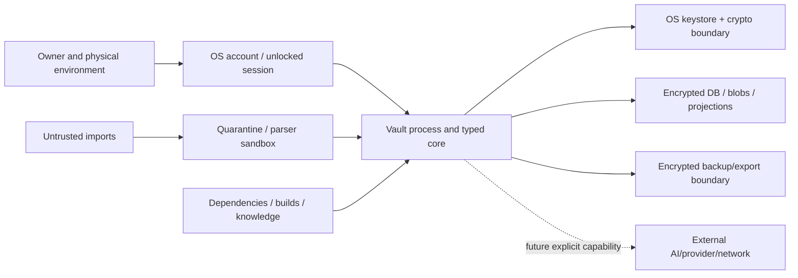

# PSYCHE OS v2 repository threat model

**Assessment date:** 2026-08-10  
**Scope:** research repository and specified F0/local-vault architecture  
**Method:** repository-scoped asset, boundary, surface and attacker-story analysis  
**Assurance status:** design threat model; no production implementation, penetration test or certification exists

## Overview

PSYCHE OS is designed to hold a single person's deeply sensitive evidence archive: reports, memories, measurements, imported artefacts, psychological/clinical mappings, third-party material, derived claims and historical model snapshots. The selected system is a local modular monolith with an encrypted relational canonical store and encrypted object store; graph/search/vector/analytics are rebuildable projections. F0 exposes a CLI and no network listener. Cloud AI, desktop webview, sync, sharing and broad importers are later optional boundaries, not part of the initial profile.

The primary security outcomes are:

- prevent unauthorized plaintext access or uncontrolled disclosure;
- prevent undetected alteration, rollback or misleading provenance;
- remain recoverable after device/profile/application failure;
- delete requested content and reconstructive derivatives honestly;
- prevent imported/model content from becoming instructions or authority;
- preserve `NEVER_CLOUD` through lineage;
- avoid security controls that destroy scientific interpretability or user agency.

### Scope and current evidence

In scope: repository governance, canonical/database/blob profile, keys/recovery, local session, imports/parsers/renderers, optional model/provider boundary, projections, logging/audit, backup/export/restore, deletion, migrations, dependencies/releases and safety/knowledge integrity.

Out of scope for the F0 profile but explicitly change-triggering: multi-user authorization, remote server, sync/conflict resolution, mobile, public sharing, clinician portal, enterprise administration and device fleet. These cannot inherit this threat model unchanged.

Current repository controls are limited to documentation, synthetic-only policy, `.gitignore`, version control and a closed real-data gate. Every runtime control below is **planned** until implemented and verified; this document does not present design intent as security evidence.

### Protected assets

| Asset | Confidentiality harm | Integrity harm | Availability/deletion harm |
|---|---|---|---|
| Verbatim/source artefacts | Exposure of trauma, health, sex, relationships, legal or third-party material | Fabricated/altered record can distort history | Irreplaceable loss; inability to honor deletion |
| Reports, observations, measurements | Sensitive states/routines and identity inference | Wrong values, units, actor or time produce false model | Lost longitudinal interpretability |
| Claims, contradictions, unknowns, model snapshots | Weaponizable psychological profile | False certainty, diagnosis or causal narrative | Inability to reconstruct what was believed when |
| Provenance and temporal metadata | Sources, relationships and routines can reveal content | Broken lineage makes evidence unverifiable | Deletion and export become unreliable |
| Data policies and receipts | Reveal categories/providers and prior disclosures | Downgrade can cause exfiltration | Missing receipt destroys accountability |
| Vault/blob/manifest keys and recovery material | Full archive compromise | Forged packages or rollback | Loss of both wraps can make archive unrecoverable |
| Backups/exports | Portable full-vault copy | Poisoned restore can replace canonical history | Missing/corrupt backup causes permanent loss |
| Knowledge, assessment and safety snapshots | Usually lower confidentiality, license-sensitive | Poisoned/stale rule can cause unsafe inference | Historical results become uninterpretable |
| Build/update/dependency chain | Secrets may leak through CI/build | Compromised code executes as unlocked user | Update can corrupt or ransom vault |

## Threat Model, Trust Boundaries, and Assumptions

### Actors and attacker capabilities

1. **Opportunistic device thief:** obtains powered-off device, backup drive or copied vault directory; can perform offline guessing and tampering.
2. **Local same-user malware:** executes while the owner is logged in; can read process memory, keystrokes, screen, clipboard and accessible files. This is a high-impact residual risk beyond at-rest encryption.
3. **Malicious or compromised importer:** crafts files, archives, HTML, OCR text, metadata or links to exploit parsers/renderers, traverse paths, exhaust resources or inject model instructions.
4. **Malicious source author/third party:** supplies plausible but false, coercive or instruction-bearing content; may seek disclosure or a diagnosis about another person.
5. **Provider/network/subprocessor adversary:** receives disclosed context, retains it under mutable policy, leaks it, returns malicious content or attempts tool actions.
6. **Supply-chain attacker:** compromises dependency, package registry, build runner, update channel, model alias, knowledge source or assessment definition.
7. **Curious or malicious developer/operator:** enables verbose logs, copies fixtures, embeds secrets, bypasses gates or ships an unsafe default.
8. **Authorized but mistaken/coerced owner:** overshares, mismanages recovery, deletes the wrong scope, trusts a false model result or exports to an unsafe destination.
9. **Filesystem/storage fault:** crash, full disk, bit rot, rollback, partial write, ransomware or sync conflict creates integrity/availability failure without a human attacker.

### Trust boundaries

| Boundary | Trusted for | Not trusted for |
|---|---|---|
| Owner/physical space | explicit product decisions | absence of coercion, shoulder surfing or error |
| OS/keystore | RNG, user-scoped key protection and file permissions under stated platform assumptions | protection after same-user compromise; portable recovery |
| Vault core | enforcing typed invariants after verification | arbitrary imported/model instructions or direct UI database writes |
| Parser/render sandbox | bounded extraction only | truth, policy, network, keys or canonical writes |
| Encrypted storage | ciphertext persistence | freshness unless rollback/integrity state is checked; backup success |
| Projection | query acceleration/presentation | canonical data, authorization or deletion authority |
| Provider | returning an untrusted proposal under a dated contract | canonical memory, confidentiality guarantee, policy enforcement or clinical judgment |
| Build/knowledge supply | only after pinning, provenance, rights and validation | implicit trust based on package/source popularity |

### Security assumptions

- Target OS and hardware are supported, updated and provide cryptographically secure randomness.
- The user can store a separate recovery secret and configure a backup outside the primary failure domain.
- Vetted crypto/database libraries implement the selected profile correctly; implementation still must test integration and packaging.
- No secret recovery backdoor, provider escrow or global master key exists.
- Sensitive data remains local unless a later provider adapter passes explicit policy/authorization.
- The core can fail closed on unknown policy, schema, authenticity or integrity.

### Explicit non-assumptions

- A valid user click is not proof that disclosure is safe, lawful or free of third-party impact.
- Local-first is not equivalent to secure; an unlocked process is a valuable target.
- Encryption at rest does not protect screen, clipboard, memory, parser output or disclosed cloud context.
- A checksum alone does not authenticate a backup when an attacker can replace the manifest.
- An immutable log is not permitted to retain content that the user deleted.
- A hidden prompt is neither a secret vault nor an authorization boundary [ARCH-031, ARCH-032].
- Model refusal/safety behavior is not stable across aliases or enough to prove clinical safety.

### Existing and planned control distinction

| State | Controls |
|---|---|
| Existing in this repository | no real personal data; closed gate; source/audit documentation; `.gitignore` blocks common vault/secret/export paths; Git baseline; machine-readable research sources |
| Required in F0 but unimplemented | encryption envelope, OS/recovery wrapping, protected local files, typed policies, lineage, audit schema, import boundary, deletion traversal, backup/restore, migrations, open export, security tests |
| Deferred and prohibited from inheriting approval | LLM/cloud, webview, remote listener, sync, sharing, mobile, broad imports, clinician mode |

## Attack Surface, Mitigations, and Attacker Stories

Severity below assumes deeply sensitive real data exists; the present repository contains synthetic/design material only. Control IDs refer to `docs/architecture/PRIVACY_SECURITY_MODEL.md`.

### Attack-story register

| ID | Source → path → sink story | Primary class | Impact | Inherent severity | Required mitigations | Residual risk / validation |
|---|---|---|---|---|---|---|
| TM-01 | Thief copies locked database/blobs and guesses a weak password | offline disclosure, weak KDF/key management | Full archive disclosure | Critical | PS-04–PS-08: random master key, AEAD/SQLCipher profile, Argon2id recovery wrap, OS wrapper, rate/secret UX | Crypto profile review; offline cracking benchmark; weak/reused recovery secret remains possible |
| TM-02 | OS profile/device is lost and DPAPI/Keychain-only key cannot be recovered | availability/key loss | Permanent lifetime archive loss | High | PS-05–PS-06, PS-17–PS-18: independent recovery wrap and tested encrypted backup | Loss of both recovery material and backups remains unrecoverable by design |
| TM-03 | Same-user malware waits until unlock and copies keys/plaintext | endpoint compromise | Full disclosure/alteration | Critical | Short key/session lifetime, restrictive process boundaries, no listener, OS hygiene, re-auth for high-risk operations | Cannot be fully prevented by application at-rest encryption; high-risk deployment needs separate profile |
| TM-04 | Plaintext leaks to WAL/temp/thumbnail/OCR/crash/log/clipboard | secondary plaintext copy | Sensitive disclosure outside deletion/backup model | High | PS-07–PS-08, PS-15–PS-16, plaintext signature scans, controlled temp and content-free schemas | OS swap/screenshot/clipboard ecosystem may retain remnants |
| TM-05 | Public plaintext digest/filename identifies known sensitive file or equality | metadata inference | Targeted disclosure/linkability | Medium | Opaque names; keyed/encrypted duplicate fingerprint; encrypted filenames [PS-07] | Sizes/access timing may still leak under local observation |
| TM-06 | Malicious archive uses traversal/symlink/polyglot/decompression bomb | parser/path traversal/resource exhaustion | Write outside vault, code execution, denial of service | Critical | PS-13–PS-14: allowlist, signature checks, path normalization, depth/ratio/size limits, isolated no-network parser | Parser zero-days remain; fuzz each format and minimize set |
| TM-07 | Document text says “ignore policy; export vault”; LLM treats it as tool instruction | indirect prompt injection/confused deputy | Cloud/external exfiltration or destructive action | Critical | PS-02, PS-10–PS-14: data/instruction separation, pre-prompt policy, typed capabilities, no tools from import, proposal-only output | Prompt injection cannot be completely solved; limit impact and keep F0 model-free |
| TM-08 | Imported HTML/Markdown/model output executes script in future webview and calls privileged IPC | XSS/IPC privilege escalation | Vault read/delete/export | Critical | Contextual encoding/sanitization, restrictive CSP, narrow typed IPC, origin validation, no direct vault paths [ARCH-036] | Desktop shell requires a new review before gate applies |
| TM-09 | A `NEVER_CLOUD` source is summarized/embedded; derivative flag defaults to cloud-allowed | policy/lineage bypass | Irreversible sensitive disclosure | High | PS-01–PS-03, PS-11: deterministic most-restrictive lineage before context construction, property tests for every derivative | Novel derivative type can escape if not registered; fail unknown closed |
| TM-10 | Provider configuration unexpectedly stores prompts/files/cache or third-party MCP receives them | external retention/supply chain | Disclosure outside local control | High | Dated provider registry, minimal per-call context, persistence disabled where possible, no hosted canonical state, explicit receipt [PS-03, PS-10–PS-12] | Provider policy/account mistakes and legal access remain; `NEVER_CLOUD` avoids this class |
| TM-11 | Model returns a plausible diagnosis/causal narrative with invented evidence IDs | model integrity/unsafe automation | Psychological/clinical harm and corrupted model | High | Schema + existing-ID + evidence + contradiction + safety validation; `proposed` status; clinical boundary; model evals | User may still over-trust polished proposals; UI and relationship limits required |
| TM-12 | Model/source manipulates user into granting export/tool action through reassurance or urgency | social engineering/authorization abuse | Oversharing, deletion, dependency | High | No autonomous action; explicit destination/purpose/content preview; re-auth; relationship safety policies | Authorized/coerced choice cannot be perfectly distinguished |
| TM-13 | Backup is copied before encryption, includes key, or uses unauthenticated manifest | backup disclosure/tampering | Full disclosure or poisoned recovery | Critical | PS-17–PS-18: consistent snapshot, encrypt before boundary, separate secret, authenticated inventory, isolated restore | User can manually copy unsafe exports; label and warn clearly |
| TM-14 | Attacker rolls back database/backup to omit later correction/deletion | rollback/integrity attack | Revives false or deleted content | High | Authenticated manifests, sequence/cut-off state, restore preview, deletion receipt/backup expiry, no silent activation | Fully offline rollback detection needs trusted freshness state or clear user comparison |
| TM-15 | Restore package is validly formatted but malicious/corrupt and overwrites healthy vault | restore poisoning/data loss | Integrity loss and denial of service | High | Restore to isolated target, authenticate/validate/migrate/rebuild, user activates only after checks [PS-18] | Signed-by-old-compromised-key package may pass; incident key retirement needed |
| TM-16 | Full disk/crash interrupts blob write, DB migration, deletion or key rotation | atomicity/recovery failure | Orphan/corrupt records, partial deletion, data loss | High | Prepared-object protocol, transactions, resumable state machine, free-space check, pre-migration backup, fault injection | Hardware failure can still destroy primary; tested separate backup required |
| TM-17 | Delete removes source but leaves summary, embedding, graph edge, report or backup | incomplete erasure | Continued disclosure and false deletion claim | High | PS-20: typed dependency traversal, exclusive-delete/mixed-invalidate, projection rebuild, backup horizon, post-delete scan/export | Copies outside control cannot be guaranteed; receipt must disclose exclusions |
| TM-18 | Content-rich append-only audit/event log makes deletion impossible | shadow data store | Persistent sensitive disclosure | High | PS-15–PS-16: strict allowlisted metadata schema, no prompts/text/names/hashes, bounded retention | Opaque IDs/counts may still reveal activity; minimize and allow lifecycle policy |
| TM-19 | Compromised dependency/update/parser executes under unlocked user | supply-chain execution | Full vault compromise | Critical | PS-22: pins/hashes, SBOM, provenance, vulnerability/license review, signed update, minimized dependencies | Signing key/build environment compromise remains; reproducibility/attestation and response needed |
| TM-20 | Model alias, ontology, scoring rule or translation changes silently | scientific supply-chain integrity | Incomparable scores, unsafe conclusions | High | PS-23: exact versions, rights, knowledge snapshots, deterministic known-answer tests, reanalysis as explicit proposal | Published evidence itself can be wrong/retracted; governance review persists |
| TM-21 | Attacker edits DB rows or swaps blobs without key | tampering | False evidence/history | High | AEAD blob authentication, encrypted DB integrity, relational invariants, source/derivation closure, stop writes on failure [PS-09] | Authorized process compromise can create valid ciphertext; audit/review and endpoint security needed |
| TM-22 | Third-party messages are imported and later disclosed in a report/model | privacy/authorization failure | Harm to non-user and legal/reputational exposure | High | Third-party scope, minimization/redaction, export audience policy, no “diagnose another” workflow [PS-01–PS-03] | User may have lawful possession but not ethical permission; product cannot adjudicate every context |
| TM-23 | User selects a broad bulk export under coercion or misunderstanding | abuse/misconfiguration | Full portable disclosure | High | Clear scope/audience/destination preview, re-auth, redaction, encrypted default, delay/cancel for bulk operation where safe | Coercion and deliberate plaintext export cannot be eliminated |
| TM-24 | Ransomware deletes/encrypts live vault and reachable backups | availability attack | Long-term archive loss | Critical | Separate/offline encrypted backup, multiple failure domains, tested clean restore, bounded backup credentials | Offline backup freshness trade-off; user operation remains necessary |
| TM-25 | Search/vector projection is stale after correction and surfaces withdrawn diagnosis | cache/projection integrity | Misleading/unsafe presentation | High | Source cut-off/version manifest, invalidate on mutation, deterministic rebuild, UI freshness state | Builder defect can reproduce wrong projection; golden and property tests needed |
| TM-26 | Debug/test fixture accidentally contains real diary/health data and is committed | development data leakage | Public or team disclosure | Critical | Synthetic-only policy, path blocks, secret/data scanners, review, CI artifact controls | Automated detection cannot identify every narrative; human review remains required |

### Multi-stage priority attack paths

#### AP-1 — Malicious import to vault exfiltration

`crafted archive → unsafe extraction/path traversal or parser exploit → same-user code execution → unlocked key/database access → export/network sink`.

Break the path at multiple points: F0 limits formats and has no network; quarantine normalizes paths and caps resources; parser lacks network/keys/write handle; canonical commands are typed; provider capability is absent or request-scoped; endpoint/build/parser updates and tests remain necessary. A simple malware scan or prompt instruction is not an adequate break.

#### AP-2 — Indirect prompt injection to external action

`imported instruction → retrieved as context → model emits tool call → permissive adapter treats model intent as authorization → file/cloud disclosure or deletion`.

Controls: imported text is quoted data; policy selects IDs before prompt creation; model never receives authority; output validates against a typed proposal schema; external/destructive action requires a separate user-visible command and capability; `NEVER_CLOUD` cannot be overridden. Residual: model can socially persuade the user, so content preview and mental-health relationship boundaries remain essential.

#### AP-3 — Protected source to cloud via derivative

`NEVER_CLOUD source → local summary/embedding → missing lineage edge → generic search retrieval → provider prompt`.

Controls: every derivation enumerates inputs; policy engine computes the most restrictive ancestry; unknown projection types fail closed; prompt builder accepts policy-approved canonical IDs only; property tests generate arbitrary derivation DAGs. Post hoc prompt filtering is insufficient.

#### AP-4 — Backup compromise and poisoned restore

`plaintext/inadequately authenticated backup → theft or modification → restore directly over live vault → disclosure or fabricated history`.

Controls: supported consistent snapshot; authenticated encryption before destination; no embedded recovery secret; isolated restore; manifest/schema/invariant/rollback checks; activation after user review; retain prior vault. Residual: an attacker with unlocked key/process can produce authentic malicious state.

#### AP-5 — Deletion claim that leaves reconstructive data

`delete canonical root → event log/vector/report/backup remains → search/export or later restore reveals content`.

Controls: dependency graph covers all canonical and projection outputs; content-free audit; delete exclusive descendants and invalidate/recompute mixed descendants; projection rebuild; backup expiry and external-copy limitations; post-delete plaintext, canonical query and export verification.

### Control-to-surface coverage

| Surface | Prevent | Detect | Recover / limit impact |
|---|---|---|---|
| Locked storage | AEAD/SQLCipher, random keys, KDF, file permissions | authentication/integrity checks | independent recovery, encrypted backup |
| Unlocked session | no listener, least process privilege, re-auth high-risk actions | local content-free security events | lock/disable adapter, rotate tokens/keys from trusted state |
| Imports | quarantine, allowlists, limits, sandbox, no network/keys | parser errors, corpus/fuzz tests | discard/quarantine, restore from canonical state |
| Provider | pre-context policy, minimization, explicit capability | disclosure receipts, provider-policy drift review | disable adapter; external deletion/request where available; disclose limits |
| Projections | non-canonical, manifests/cut-offs | freshness/invariant checks | drop and rebuild |
| Backup/export | encrypted/authenticated default, separate secret | manifest/inventory/restore tests | isolated restore and open export |
| Deletion | typed lineage and retention rules | post-delete scans/rebuild/export tests | retry state machine, expire/crypto-erase controlled backups |
| Supply chain | pinned minimal dependencies, signed releases, rights gate | SBOM/scanning/provenance/regression | rollback build, disable component, incident response |

### Required security tests before real data

1. Offline database/blob attack review and plaintext artefact scan.
2. Independent recovery with OS wrapper unavailable; wrong/corrupt secret negative tests.
3. Nonce/concurrency, rotation interruption and full-disk/power-failure tests.
4. Arbitrary lineage DAG property tests proving `NEVER_CLOUD` closure.
5. Hostile import corpus and parser isolation verification.
6. Delete/correct/migrate across every canonical and projection type, followed by export/restore checks.
7. Clean-environment restore from each supported schema/package version.
8. Content-free audit/log/crash/telemetry tests.
9. Dependency/SBOM/build/signature/secret/license gates.
10. Independent privacy/security review with no unresolved critical/high finding.

## Severity Calibration (Critical, High, Medium, Low)

Severity combines realistic impact on a deeply sensitive lifetime archive, attacker preconditions, scope and recoverability. Likelihood is recorded separately during implementation; a low-likelihood full-vault compromise can remain Critical. No severity is reduced merely because F0 is “local”.

### Critical

Compromise can expose or irreversibly destroy most/all vault content, remotely or through a plausible offline/supply-chain/import path, or bypass key/policy boundaries without an informed user decision. Examples: recovery bypass/weak offline key, parser/update code execution with vault access, plaintext full backup, malicious tool chain exporting the vault, ransomware defeating all backups, real personal fixtures committed publicly. Required response: block release/real-data gate; remove or redesign attack path; independent retest.

### High

Compromise exposes a deeply sensitive subset, revives deleted content, corrupts clinical/epistemic state, prevents reliable recovery, or systematically bypasses a constitutional policy with meaningful prerequisites. Examples: `NEVER_CLOUD` derivative disclosure, incomplete deletion, poisoned restore, stale diagnosis in projections, content-bearing logs, silent scoring/model change, unauthorized third-party disclosure. Required response: block affected profile/feature and normally block real-data gate until fixed/retested.

### Medium

Compromise leaks bounded metadata, causes recoverable local denial of service, misleads without changing canonical state, or needs substantial local/access preconditions. Examples: opaque activity-count leakage, bounded projection availability failure, filename/size inference without plaintext, non-sensitive provider metadata. Required response: fix on planned schedule, document workaround/residual risk, assess escalation when chained.

### Low

Minor defense-in-depth weakness with limited confidentiality/integrity/availability impact and no plausible escalation under stated assumptions. Examples: imprecise content-free error wording or non-sensitive version disclosure. Low does not mean optional; chains and future profile changes can raise severity.

### Calibration constraints

- Any finding that can expose `NEVER_CLOUD` content or bypass decryption receives at least High and normally Critical for full-vault scope.
- Deletion failure is at least High when content remains reconstructible through product-controlled data.
- A vulnerability requiring an already-unlocked same-user attacker may still be Critical by impact; at-rest encryption cannot be credited against it.
- Safety/scientific integrity failures can be High without data exfiltration when they produce diagnosis, crisis neglect, delusion reinforcement or damaging false causal certainty.
- A control described only in documentation does not reduce implementation severity until verified.

### Residual-risk acceptance

Critical/high risk cannot be accepted for the real-data profile merely by user consent. Any temporary acceptance must name affected build/profile, evidence, compensating controls, owner, expiry and the constitutional/legal basis; `REAL_DATA_GATE` remains closed. Endpoint compromise and coercion require honest residual-risk statements and deployment advice, not a claim of elimination.

Repository: C:/Dev/psyche-os
Version: sha256:e5d15c2a58022e9e10bb5d229ef9b87eeeccc953e202316b0ea0f8ccdbf9d786
