# PSYCHE OS v2 — Measurement & Longitudinal Evidence Contract

**Статус:** research workstream, evidence-first  
**Срез знаний:** 2026-08-10  
**Назначение:** контракт для психометрики, повторных измерений, EMA/ESM, сна, пассивного сенсинга, идиографической аналитики, N-of-1 и реестра вмешательств.  
**Реестр источников:** `SOURCES_MEASUREMENT.yaml` (50 уникальных источников, идентификаторы `MEAS-*`).

## 1. Исполнительное резюме

1. Любой балл, норма, порог, ошибка измерения и статус изменения вычисляются только детерминированным, версионированным модулем из лицензированного определения инструмента. LLM не считает баллы, не восстанавливает пропуски, не переводит пункты и не «адаптирует» нормы.
2. Скрининг не является диагнозом. Даже валидированный опросник остается инструментом для определенной цели, популяции, языка, режима предъявления и контекста применения; перенос на другой контекст требует доказательств, а не сходства названия [MEAS-001, MEAS-002, MEAS-003].
3. Русскоязычная версия допускается как стандартизированное измерение только при установленном праве использования, документированной межкультурной адаптации и достаточной проверке измерительных свойств. Самодельный или LLM-перевод хранится как пользовательский текст и **не наследует** норм, порогов, IRT-параметров или заявлений о валидности [MEAS-004, MEAS-005].
4. Повторное измерение — отдельный режим, а не бесконечное повторение скрининга. Оно требует цели, допустимой частоты, эквивалентности во времени, минимально значимого/достоверного изменения, учета ошибки и тренировочного эффекта [MEAS-002, MEAS-009, MEAS-010].
5. EMA/ESM проектируется от исследовательского вопроса и процесса во времени. Частота опросов, окно ответа, период наблюдения и адаптивность протокола фиксируются до сбора; burden, adherence, reactivity и missingness являются данными качества, а не моральной оценкой пользователя [MEAS-022–MEAS-027].
6. Sleep OS сохраняет раздельно дневник, actigraphy/research-grade данные, consumer-wearable данные, клинические исследования и выводы. Потребительский трекер не заменяет PSG/HSAT и не диагностирует нарушения сна; модель, firmware и версия алгоритма входят в provenance [MEAS-012–MEAS-021].
7. Пассивный сенсинг допускается только как явно согласованный, минимизированный и проверяемый источник наблюдений. Корреляции с симптомами не превращаются в «цифровые биомаркеры» конкретного человека без внешней валидации, калибровки и доказанной клинической полезности [MEAS-028–MEAS-031].
8. Межиндивидуальные и внутрииндивидуальные эффекты принципиально различаются. Групповая корреляция не является персональным правилом; временной порядок не доказывает причинность [MEAS-032–MEAS-034].
9. Причинный язык управляется лестницей доказательств. По умолчанию система сообщает описания, ассоциации и временные предшествования. N-of-1 допускается только с планом, достаточной базовой линией, повторением фаз, учетом автокорреляции, переносов, пропусков и stop-criteria [MEAS-035–MEAS-043].
10. Самопомощь ограничена низкорисковыми, обратимыми действиями. Лекарства, добавки, лишение сна, опасные экспозиции, кризисные состояния и клиническая диагностика не автоматизируются. Любое вмешательство поступает только через версионированный evidence registry [MEAS-044–MEAS-048].
11. Computational psychiatry остается исследовательским слоем: модель может предлагать проверяемые гипотезы, но не объявлять латентный механизм, диагноз или индивидуальный прогноз без независимой валидации, калибровки и оценки пользы [MEAS-049, MEAS-050].

## 2. Эпистемический статус и уровни доказательств

Этот документ задает требования к продукту, а не клинические рекомендации конкретному человеку. Он синтезирует стандарты, руководства, систематические обзоры, метаанализы и методологические работы. В реестре используются следующие уровни:

| Tier | Назначение |
|---|---|
| `official_standard_or_guideline` | Нормативное руководство профессионального/регуляторного органа; определяет процесс, границы или отчетность, но не гарантирует применимость к каждой популяции. |
| `systematic_review_or_meta_analysis` | Синтез исследований; сила вывода ограничена гетерогенностью и качеством первичных работ. |
| `methodological_consensus` | Консенсус, учебник или reporting guideline; задает проектирование и прозрачность, но не заменяет эмпирическую валидацию. |
| `foundational_methodology` | Базовая методологическая работа, используемая как принцип; требует проверки на актуальность конкретного применения. |
| `strong_primary_evidence` | Крупная или особенно важная первичная программа валидации; не переносится автоматически за пределы своей выборки. |
| `expert_consensus_or_position` | Экспертное заключение/позиция; используется для осторожных границ при ограниченных сравнительных данных. |
| `emerging_synthesis` | Новая область с неоднородными исследованиями; пригодна главным образом для ограничения сильных утверждений и формирования research backlog. |

Правило конфликта: актуальное регуляторное или профессиональное руководство для заданного context of use имеет приоритет над обзором; более свежий обзор не отменяет фундаментальный методологический принцип без явного основания. Любая спорная интерпретация помечается как неопределенная и получает review trigger.

## 3. Психометрический контракт

### 3.1. Начинать с конструкта и context of use

До добавления любого измерения реестр обязан ответить:

- какой конструкт и аспект конструкта измеряется;
- у кого, на каком языке и в каком культурном контексте;
- режим: скрининг, мониторинг, outcome, исследование, поддержка разговора или клиническое решение;
- период воспоминания и единица времени;
- кто интерпретирует результат и какое действие может последовать;
- какими свидетельствами подтверждены content validity, structural validity, internal consistency, reliability, measurement error, construct/criterion validity, responsiveness и cross-cultural validity;
- разрешено ли применение, цифровое предъявление, перевод, изменение формулировки и хранение пунктов.

Валидность относится не к тесту «вообще», а к интерпретации балла для заданной цели. Надежность без валидности недостаточна; высокая внутренняя согласованность не доказывает одномерность; статистическая значимость изменения не означает клиническую значимость [MEAS-001–MEAS-003].

### 3.2. CTT, IRT и CAT

| Модель | Допустимое применение | Обязательные ограничения |
|---|---|---|
| Classical Test Theory (CTT) | Фиксированные формы, подсчет суммы/подшкал, reliability и standard error в изученной выборке. | Параметры зависят от выборки и формы; alpha не равна всей надежности; нельзя переносить ошибку и пороги без проверки. |
| Item Response Theory (IRT) | Калиброванные item banks, информация по уровню латентного признака, linking/equating. | Нужны проверенные dimensionality, local independence, monotonicity/model fit, DIF и калибровка для целевой популяции. |
| Computerized Adaptive Testing (CAT) | Выбор следующего пункта и stopping rule из лицензированного калиброванного банка. | Item exposure, security, content balancing, precision threshold и версия банка детерминированы. LLM не выбирает «похожий» пункт и не генерирует новый. |

CTT и IRT дают разные, дополняющие сведения; ни одна модель не устраняет необходимость content validity и проверки context of use [MEAS-007, MEAS-008].

### 3.3. Минимальный набор измерительных свойств

Для каждого инструмента в `AssessmentRegistry` хранится отдельная оценка:

- `content_validity`: релевантность, полнота и понятность для целевой популяции;
- `structural_validity`: соответствие структуры модели;
- `internal_consistency`: только при приемлемой структурной валидности;
- `reliability`: test-retest/inter-rater/intra-rater в подходящем стабильном интервале;
- `measurement_error`: SEM/SDC или иной обоснованный показатель;
- `construct_validity`: заранее заданные гипотезы о связях и различиях;
- `criterion_validity`: только при обоснованном criterion/gold standard;
- `cross_cultural_validity_or_invariance`: язык, культура, пол/возраст и иные важные группы;
- `responsiveness`: способность обнаруживать изменение, соответствующее construct of interest;
- `interpretability`: распределение, floor/ceiling, reference values, минимально важное изменение, если оно валидно;
- `feasibility_and_burden`: время, когнитивная нагрузка, доступность и условия предъявления.

Если свойство не изучено, значение — `unknown`, а не `passed`. Система не выводит «улучшение/ухудшение», если наблюдаемое изменение не отделимо от ошибки, практики, сезонности, вмешательства или смены версии инструмента.

### 3.4. Measurement invariance

Сравнение средних/траекторий между группами или временем разрешено лишь при достаточной эквивалентности измерения. Последовательность проверки: configural → metric → scalar; для сравнения residual/individual change может требоваться более строгая инвариантность. Partial invariance допустима только по заранее описанному правилу и с sensitivity analysis. Отсутствие статистически обнаруженного DIF не доказывает эквивалентность при малой мощности [MEAS-009].

### 3.5. Лицензирование и русскоязычная валидность

`AssessmentRegistry` блокирует предъявление до положительного rights gate. Минимальные поля:

```text
assessment_id, canonical_title, owner, copyright_status, license_id,
allowed_uses, allowed_languages, allowed_modes, item_storage_policy,
scoring_algorithm_version, source_form_version, translation_version,
target_population, age_range, recall_period, administration_window,
norm_reference, norm_date, thresholds, measurement_properties,
missing_item_rule, change_interpretation_rule, provenance, review_due
```

Русскоязычный pipeline:

1. Получить право на перевод/адаптацию и проверить наличие авторизованной русской версии.
2. Определить construct, population и intended use; провести независимые forward translations, reconciliation, back translation/quality review и cognitive debriefing по правообладательским требованиям.
3. Проверить понятность и культурную релевантность, затем структурную валидность, надежность, ошибку, DIF/инвариантность и, для мониторинга, responsiveness.
4. Документировать вариант русского языка, регион, возраст, способ предъявления и выборку.
5. Использовать нормы/пороги только если они прямо относятся к этой версии и context of use.

Удобная русская формулировка без такого процесса — `unvalidated_translation`. Для нее запрещены standardized score, percentile, clinical cutoff, norm comparison, CAT/IRT scoring и claim о валидированном скрининге [MEAS-004–MEAS-006]. Тексты пунктов и manual не копируются в репозиторий без проверенных прав [MEAS-006, MEAS-011].

### 3.6. Детерминированные и LLM-границы

| Функция | Детерминированный модуль | LLM | Только специалист / research-only |
|---|---|---|---|
| Подсчет балла, reverse coding, подшкалы | Обязательно; exact version + test vectors. | Запрещено. | Аудит алгоритма при изменении версии. |
| Missing-item rule | Точно по manual; иначе `not_scored`. | Не импутирует и не «догадывается». | Новая модель импутации — research protocol. |
| Нормы, T-score, percentile, cutoff | Только лицензированная таблица/формула для валидной версии. | Не переводит и не переносит нормы. | Клиническая интерпретация остается за специалистом. |
| CAT item selection/stopping | Версионированный IRT/CAT engine. | Не генерирует и не заменяет пункты. | Новая калибровка — validation study. |
| Изменение во времени | Предзаданный алгоритм: качество, SDC/CI, practice flag, comparable-version gate. | Может изложить уже вычисленное простым языком. | Диагностическое/лечебное значение — специалист. |
| Резюме ответов | Сохраняет verbatim и вычисленные поля раздельно. | Может предложить черновое тематическое резюме с цитируемой provenance. | Не считается свидетельством и требует проверки человеком. |
| Причинность | Causality engine ограничивает допустимую лексику. | Только формулирует гипотезы и альтернативы. | Causal claim требует соответствующего дизайна/анализа. |
| Safety routing | Детерминированные правила, локальная обработка и human escalation. | Не понижает и не отменяет уровень риска. | Кризисная оценка и лечение — специалист/служба. |
| Rights/privacy gate | Детерминированный deny-by-default. | Не может отменить policy. | Исключения — документированное решение владельца данных/прав. |

LLM-ответ всегда сохраняется как `proposal`, с model/version, input provenance, временем, локалью и ссылками на исходные записи. Он не становится evidence, observation или историческим фактом без отдельного подтверждения.

## 4. Политика повторных измерений

### 4.1. Режимы

| Режим | Цель | Типичная единица времени | Основной риск |
|---|---|---|---|
| `one_time_screen` | Определить необходимость разговора/помощи. | Однократно или по установленному клиническому интервалу. | Превратить cutoff в диагноз. |
| `periodic_outcome` | Оценить изменение конструкта валидным PROM. | Интервал соответствует recall period и responsiveness. | Ошибка, практика, сезонность, regression to mean. |
| `daily_diary` | Проспективная запись суток/событий. | 1 раз/день. | Ретроспективное заполнение и burden. |
| `ema_esm` | Внутридневная динамика и контекст. | Несколько сигналов/событий в день по протоколу. | Реактивность, informative missingness. |
| `passive_stream` | Наблюдаемая характеристика устройства/поведения. | Событие/эпоха с quality flags. | Surrogate fallacy, drift, privacy. |
| `n_of_1_experiment` | Сравнить заранее заданные состояния/вмешательства у одного человека. | Фазы/периоды с повторением. | Carryover, autocorrelation, concurrent change, harm. |

### 4.2. Gate перед запуском

Повторение разрешено, только если заданы:

- конкретный вопрос и decision use;
- sampling frame, cadence, duration, time zone, quiet hours и response window;
- минимально достаточное число наблюдений для выбранного анализа;
- evidence о применимости инструмента в повторном режиме и expected within-person variability;
- burden budget и способ паузы/отказа без penalty;
- правила пропусков, поздних ответов, дубликатов и смены устройства/версии;
- план анализа, multiplicity family и допустимый causal language;
- stop criteria и safety route.

Если эти поля отсутствуют, система предлагает обычную заметку или ограниченный дневник, но не создает «эксперимент».

### 4.3. Интерпретация изменения

Порядок вычисления обязателен:

1. Проверить сопоставимость версии, языка, режима, окна и контекста.
2. Вывести completeness и quality flags.
3. Показать raw trajectory и robust summary; не скрывать выбросы без правила.
4. Оценить uncertainty и отличимость от measurement error; если доступно, применить валидный SDC/RCI.
5. Отметить retest/practice effect, regression to mean, внешние события и concurrent interventions.
6. Только затем применить валидный минимально важный порог изменения.

`score_delta != true_change`; `true_change != important_change`; `important_change != caused_by_intervention`.

## 5. EMA/ESM protocol contract

### 5.1. Sampling design

Допустимы и сохраняются раздельно:

- `signal_contingent_random`: случайный сигнал в стратах времени;
- `fixed_interval`: заранее заданные моменты;
- `event_contingent`: ответ при четко определенном событии;
- `end_of_day`: дневная ретроспекция с фиксированным окном;
- `burst`: интенсивные окна, разделенные периодами без опросов;
- `adaptive_assessment`: сокращение/выбор пунктов по предзаданной психометрической модели.

Смешанный протокол помечает источник каждого ответа. Event-contingent нельзя использовать для оценки частоты события без учета вероятности пропущенного события; signal-contingent нельзя превращать в непрерывное наблюдение. Протокол выбирается по timescale процесса, а не по «стандартным шести опросам в день» [MEAS-022, MEAS-023, MEAS-025].

### 5.2. Adherence без обвинения пользователя

Система вычисляет:

- `delivered`, `seen`, `started`, `completed`, `valid`, `late`, `dismissed`, `technical_failure`;
- compliance с явно заданным знаменателем;
- completion по времени суток/дню/фазе, latency и streak distribution;
- dropout, pause, notification delivery failure и недоступность ОС;
- reason codes, если пользователь добровольно их указал.

Нельзя объединять technical missing, deliberate skip и unavailable context в одно «non-compliant». Высокая агрегированная adherence в обзорах не является гарантией конкретного протокола: оценки неоднородны, определения различаются, а burden плохо измерен [MEAS-023, MEAS-027].

### 5.3. Burden budget

Перед запуском задаются максимумы на prompts/day, items/prompt, estimated seconds/day, consecutive days и ночные ограничения. После пилотного окна система предлагает уменьшить частоту, если растут latency, skip/partial completion, раздражение или sleep disruption. Изменение дизайна создает новую `protocol_version`; данные до и после не молча объединяются.

### 5.4. Reactivity

Самонаблюдение способно изменять поведение, эмоции и когниции; в метаанализе цифровых моментальных измерений обнаружены небольшие эффекты для ряда health behaviors, а большинство EMA-исследований вообще не тестировали reactivity [MEAS-023, MEAS-024]. Поэтому:

- до старта фиксируется ожидание возможной реактивности;
- используются run-in/baseline и, где возможно, randomized prompt intensity или control period;
- отдельно записываются отображение обратной связи, напоминания и coaching;
- «улучшение во время измерения» не приписывается вмешательству без дизайна;
- при усилении тревоги/компульсивной проверки интенсивность снижается или протокол прекращается.

### 5.5. Adaptive EMA

JITA-EMA может уменьшать число пунктов, выбирая их и stopping rule на основе IRT/CAT, но ее гибкость создает множество плохо стандартизированных решений [MEAS-026]. В PSYCHE OS адаптация допускается, если:

- item bank валидирован для momentary context;
- правило старта, выбора, stopping и uncertainty детерминировано и версионировано;
- существуют minimum content coverage и maximum burden;
- адаптация не зависит от свободного вывода LLM;
- изменение sampling probability логируется для корректного анализа;
- safety items не пропускаются адаптивным алгоритмом, когда они обязательны.

### 5.6. Missingness

Пропуск является потенциально информативным: человек может не отвечать именно при занятости, ухудшении состояния, сне, отсутствии устройства или нежелании раскрывать контекст. Требования:

- предотвращать пропуски дизайном и доступностью;
- хранить причину/техническое состояние, не подменять нулем;
- описывать MCAR/MAR/MNAR как допущение, а не установленный факт;
- primary analysis + sensitivity analyses для правдоподобных механизмов;
- LLM-импутация запрещена;
- LOCF и complete-case не применяются как безусловный default [MEAS-036].

## 6. Sleep OS

### 6.1. Разделение источников

| Слой | Что он измеряет | Разрешенный вывод | Запрет |
|---|---|---|---|
| `subjective_sleep_diary` | Восприятие bedtime, sleep latency, awakenings, wake time, quality и дневных последствий. | Проспективная субъективная траектория; основа поведенческого разговора. | Не объявлять объективные стадии сна. |
| `research_actigraphy` | Движение и алгоритмически оцененные sleep/wake patterns. | Дополнение при определенных sleep/circadian задачах по guideline. | Не заменять PSG и не диагностировать самостоятельно. |
| `consumer_wearable` | Проприетарные estimates из движения/PPG/других сенсоров. | Тренды фундаментальных показателей при стабильной версии и quality. | Диагноз, точные стадии/события дыхания, equivalence с PSG. |
| `clinical_hsat` | Ограниченное клиническое исследование дыхания во сне. | Только в подходящей клинической популяции и по клиническому workflow. | Универсальный домашний скрининг без клинической оценки. |
| `polysomnography` | EEG/EOG/EMG, дыхание и другие клинические каналы. | Клинический reference для конкретного показания. | Превращать одну ночь в полную модель обычного сна без контекста. |
| `inferred_sleep_feature` | Производная PSYCHE OS. | Только с названием алгоритма, uncertainty и source chain. | Маскировать как наблюдение устройства или диагноз. |

ICSD-3-TR используется как указатель клинической классификации, но критерии не копируются и не реализуются как самостоятельный diagnostic engine [MEAS-012].

### 6.2. Sleep diary

Основа — минимальный набор Consensus Sleep Diary: запись утром, фиксированные определения событий и сохранение raw response отдельно от derived metrics [MEAS-014]. Любое отклонение от формулировок/структуры требует rights review. Derived значения (`time_in_bed`, subjective `total_sleep_time`, `sleep_efficiency`) вычисляются детерминированно и помечаются `subjective_derived`.

### 6.3. Actigraphy и consumer wearables

AASM допускает actigraphy условно и для конкретных клинических вопросов; это не универсальный диагностический инструмент [MEAS-015]. При подозрении на OSA PSG остается стандартным диагностическим тестом, а HSAT подходит лишь определенным неосложненным взрослым в клиническом пути [MEAS-016].

Для consumer device обязательно хранить:

```text
vendor, model, hardware_revision, serial_scope_or_pseudonym,
firmware_version, app_version, algorithm_version_or_unknown,
metric_name, metric_definition, unit, sampling_window,
raw_accessibility, time_zone, sync_time, validation_reference,
population_validated, quality_flags, provenance, import_version
```

Если алгоритм не раскрыт, значение помечается `black_box_estimate`. Систематический обзор 24 исследований показал различия между wrist-worn trackers и PSG по ключевым параметрам, с высокой неоднородностью; устройство пригодно максимум для осторожного тренда, не для диагноза [MEAS-018]. Профессиональные рекомендации 2025 года советуют различать фундаментальные и exploratory proprietary metrics и выбирать устройство под intended use [MEAS-017].

### 6.4. Algorithm drift

Consumer-device validation привязана к конкретной комбинации модели/firmware/algorithm. Changelog может быть неполным: исследование обновлений обнаружило неуточненные изменения и интервалы между потенциально значимыми обновлениями до нескольких дней [MEAS-019]. Поэтому:

- обновление создает новый `device_algorithm_epoch`;
- тренд через границу эпохи получает `comparability_unknown`, пока нет bridge validation;
- кэшированное имя метрики не считается стабильным определением;
- при неизвестной версии запрещены точные before/after comparisons;
- research export содержит эпохи и changelog evidence;
- визуализация показывает смену устройства/алгоритма.

Ограниченная validation и непрозрачные изменяющиеся алгоритмы названы ключевым барьером для sleep/circadian biomarkers [MEAS-020].

### 6.5. CBT-I и границы самопомощи

Многокомпонентная CBT-I имеет guideline support для хронической инсомнии; sleep hygiene сама по себе не является достаточным лечением [MEAS-013]. PSYCHE OS может:

- давать общую образовательную информацию;
- поддерживать дневник и подготовку вопросов специалисту;
- предлагать низкорисковые привычки без обещания лечения;
- реализовать полноценный CBT-I протокол только как лицензированный, валидированный pathway с определенными eligibility/exclusion, monitoring и clinical escalation.

Самостоятельно запрещены агрессивное sleep restriction, изменение лекарств/добавок, вождение при сонливости, диагностика OSA/parasomnia/circadian disorder. При выраженной дневной сонливости, вероятных остановках дыхания, опасных parasomnia events, нарколептических симптомах, ухудшении мании/психоза, суицидальном риске или риске аварии — не экспериментировать, а маршрутизировать к клинической помощи. Чрезмерная фиксация на «идеальных» tracker scores может ухудшать сон; orthosomnia описана как клиническое наблюдение, а не формальная диагностическая категория [MEAS-021].

## 7. Digital phenotyping и пассивный сенсинг

### 7.1. Evidence position

Smartphone sensing при депрессии демонстрирует умеренную предсказательную способность в отдельных исследованиях, но риски bias, сложные пропуски и отсутствие внешней валидации ограничивают клиническое применение [MEAS-028]. Ранний обзор passive sensing показывал малые выборки и слабую интеграцию в клинику [MEAS-029]. Обзоры 2025–2026 годов подтверждают отсутствие стандартизации устройств, sampling, preprocessing, feature extraction и внешней переносимости [MEAS-030, MEAS-031].

Следовательно, passive feature — это `sensor-derived proxy`, не объективная психическая характеристика.

### 7.2. Решение по функциям

| Статус | Функции | Условия |
|---|---|---|
| `admit_limited` | Шаги/грубая активность, время ношения, battery/availability, user-initiated sleep import, coarse device state. | Явное opt-in, локальная минимизация, raw/derived separation, версия устройства, quality и простое отключение. |
| `defer_research_only` | GPS/mobility entropy, screen/app-use rhythms, Bluetooth proximity, HRV/stress, fine-grained circadian inference, communication metadata. | Нужны отдельная цель, DPIA/threat model, локальная обработка, внешняя validation, fairness, incremental utility и REAL_DATA_GATE. |
| `reject_product` | Чтение сообщений/клавиатуры, content mining, contacts/social graph, background microphone, voice emotion, face emotion, скрытый proximity surveillance, diagnosis/relapse/suicide inference из пассивных потоков. | Непропорциональная чувствительность, слабая валидность, контекстная неоднозначность и высокий риск вреда. |
| `reject_claim` | «Объективное настроение», «биомаркер депрессии», «точный стресс», «детектор лжи», causal trigger по одному сенсору. | Construct mismatch; корреляция и prediction не являются диагнозом или причинным механизмом. |

Для `NEVER_CLOUD` сенсорных данных и реконструирующих производных действует deny-by-default. Даже агрегат может реконструировать дом/работу, социальные связи или режим; privacy classification наследуется по reconstructive risk, а не только по размеру файла.

### 7.3. Minimum validation gate

Новая sensing-функция не поступает в продукт, пока нет:

- operational definition и preregistered intended use;
- независимой внешней валидации на целевых устройствах/ОС/популяциях;
- calibration, discrimination **и** decision-curve/incremental utility;
- test-retest/within-person reliability и устойчивости к missingness/drift;
- subgroup/fairness analysis и failure modes;
- понятной пользователю возможности inspect/correct/delete;
- доказательства, что более простой self-report не решает задачу безопаснее.

## 8. Longitudinal и idiographic statistical contract

### 8.1. Нормативное и идиографическое не смешиваются

`Normative model` отвечает, чем человек/группа отличается от reference population. `Idiographic model` описывает динамику внутри одного человека. Межличностная связь может менять знак или отсутствовать внутри человека; поэтому групповой коэффициент не переносится в персональное правило [MEAS-032, MEAS-033].

Все выдачи имеют `estimand_scope`:

- `between_person`;
- `within_person_contemporaneous`;
- `within_person_lagged`;
- `individual_prediction`;
- `causal_effect_assumed_design`.

Без такого поля результат не публикуется.

### 8.2. Baseline

Baseline — распределение во времени, а не одна точка. До вмешательства задаются минимальная длительность/число наблюдений, ожидаемый timescale, weekday/season/menstrual or life-event context, стабильность measurement process и критерий достаточности. При тренде, цикле или смене режима baseline моделируется, а не усредняется. Экстремальная точка входа создает высокий риск regression to mean [MEAS-035].

### 8.3. Автокорреляция, lag и stationarity

- Стандартные ошибки не вычисляются как для независимых наблюдений, если есть serial dependence.
- Lag определяется по substantive timescale; перебор lag без correction запрещен.
- Cross-lagged association без разделения stable between-person differences может вводить в заблуждение [MEAS-034].
- Проверяются trend, seasonality, change points и чувствительность к window/lag.
- Небольшая N по времени ограничивает сложность; regularization не превращает нестабильную модель в истину.

### 8.4. Missingness и irregular time

Хранятся actual timestamps и exposure/opportunity, а не только порядковый номер. Анализ не интерполирует длительные пробелы молча. Для каждого outcome выводятся coverage, longest gap, missingness by phase/context, технические потери и sensitivity analysis. Предотвращение пропусков и прозрачные допущения имеют приоритет над «современной» импутацией [MEAS-036].

### 8.5. Multiplicity и researcher degrees of freedom

До анализа фиксируется семья гипотез: outcomes × predictors × lags × windows × subgroups × transformations. Confirmatory результаты используют заранее выбранный adjustment/FDR и interval estimates; exploratory результаты помечаются и не получают causal language. P-value не измеряет размер, важность или вероятность гипотезы; выборочный отчет множества анализов разрушает интерпретацию [MEAS-037].

### 8.6. Regression to mean и concurrent change

Любое улучшение после запуска программы проверяется на:

- экстремальность точки старта;
- естественные колебания и спонтанную ремиссию;
- сезон/день недели;
- одновременно начатое лечение, отпуск, болезнь, смену устройства;
- practice/reactivity;
- selective missingness.

Before/after без control logic — описательная серия, не эффект вмешательства.

## 9. Лестница причинности

Система хранит `causality_level` и ограничивает глаголы.

| Уровень | Минимальное основание | Разрешенный язык | Запрещено |
|---|---|---|---|
| `C0_observation` | Проверенная запись/измерение. | «наблюдалось», «сообщено». | Связь или влияние. |
| `C1_cooccurrence` | Две величины совпадают во времени. | «совпадало», «сопровождалось». | «X ведет к Y». |
| `C2_temporal_precedence` | X систематически предшествует Y, quality/coverage приемлемы. | «предшествовало», «полезно как сигнал». | Причина, механизм. |
| `C3_replicated_within_person_association` | Предзаданный lag, повторение, модель serial dependence, sensitivity checks. | «устойчивая внутрииндивидуальная ассоциация». | Исключение time-varying confounding. |
| `C4_quasi_experimental` | ITS/multiple baseline/natural experiment с явными допущениями и counterfactual logic. | «совместимо с эффектом при допущениях». | Безусловный causal claim. |
| `C5_randomized_single_case` | Рандомизированные фазы/порядок, washout, повторение, blinded/objective outcome где возможно. | «оценка индивидуального эффекта». | Обобщение на других людей. |
| `C6_replicated_n_of_1_or_trial` | Репликации, адекватная мощность/точность, согласованные результаты. | «эффект подтвержден в данном дизайне/популяции». | Универсальный механизм без дополнительных данных. |

Явный causal estimand, causal diagram и допущения exchangeability/consistency/positivity нужны до causal analysis [MEAS-038]. Interrupted time series требует достаточных точек до/после, учета тренда/сезонности/autocorrelation и проверки concurrent events [MEAS-039].

## 10. N-of-1 и single-case risk tiers

### 10.1. Design-quality ladder

| Design tier | Описание | Максимальный вывод |
|---|---|---|
| `D0_tracking` | Наблюдение без манипуляции. | C0–C2. |
| `D1_exploratory_AB` | Baseline → одно изменение; без возврата/рандомизации. | Гипотеза, не эффект. |
| `D2_repeated_phase` | ABA/ABAB или multiple baseline; заранее заданные outcomes и stop rules. | C4 при правдоподобных допущениях. |
| `D3_randomized_crossover` | Рандомизированный порядок, повторные пары, washout/carryover model. | C5 для данного человека. |
| `D4_replicated_series` | Несколько качественных N-of-1/SCED с общим протоколом. | C6 в ограниченном target scope. |

CENT, SPENT и SCRIBE задают минимальную прозрачность протокола и отчета [MEAS-040, MEAS-041, MEAS-042]; AHRQ отдельно требует проектировать анализ с учетом serial correlation и периода [MEAS-043].

### 10.2. Risk tiers действий

| Risk tier | Примеры | Решение |
|---|---|---|
| `R0_observational` | Дневник, наблюдение обычного режима, сравнение контекстов без задания поведения. | Допустимо с consent/burden limits. |
| `R1_low_reversible` | Время уведомления, порядок задач, освещение в безопасных пределах, обычный режим перерывов, изменение среды без клинической цели. | Self-directed, если обратимо, не ухудшает сон/безопасность и есть stop criteria. |
| `R2_moderate_or_symptom_targeting` | Полноценные CBT/CBT-I компоненты, существенная нагрузка/диета, exposure, вмешательство при заболевании. | Только по валидированному протоколу и с профессиональным/клиническим review. |
| `R3_prohibited_autonomous` | Лекарства/дозы/отмена, добавки, вещества, опасное голодание или sleep restriction, trauma exposure, self-harm, рискованные физические нагрузки, управление острым состоянием. | PSYCHE OS не предлагает и не оптимизирует; маршрутизация к специалисту/экстренной помощи. |

Возраст, беременность, соматические/психические заболевания, история расстройства пищевого поведения, мания/психоз, суицидальность, работа с транспортом/механизмами и caregiving могут повысить tier. Модель никогда не понижает риск по собственному выводу.

### 10.3. Минимальный протокол N-of-1

- вопрос, intervention A/B и causal estimand;
- eligibility, противопоказания, prescriber/clinician ownership;
- primary outcome и measurement schedule;
- baseline sufficiency;
- randomization/blinding, если возможно;
- длина периода, onset, washout и carryover;
- concurrent interventions и adherence;
- missingness, autocorrelation и analysis version;
- multiplicity и stopping rules;
- harms/side-effects logging;
- решение после эксперимента и предел generalization.

## 11. Intervention Evidence Registry

Ни одна рекомендация не генерируется напрямую из LLM. `InterventionRegistry` — версионированный allowlist:

```text
intervention_id, canonical_name, version, target_problem, intended_population,
delivery_mode, components, dose_or_schedule, comparator, outcomes,
evidence_sources, evidence_tier, certainty, effect_estimates, harms,
contraindications, interactions, age_limits, equity_accessibility,
self_help_scope, clinician_required, crisis_exclusion, stop_criteria,
training_or_license, content_rights, locale_validity, last_reviewed, review_due
```

Требования:

1. Evidence tier пропорционален функции и риску digital health technology [MEAS-044].
2. Вмешательство описывается воспроизводимо по TIDieR: why/what/who/how/where/when/tailoring/modification/fidelity [MEAS-045].
3. Certainty отделена от magnitude; GRADE judgments и reasons сохраняются [MEAS-046].
4. Harms собираются систематически, а отсутствие сообщения не трактуется как отсутствие вреда [MEAS-047].
5. Guided self-help допускается только в пределах конкретного evidence-based pathway; guideline одной страны — контекстное свидетельство, не универсальный закон [MEAS-048].

LLM может подобрать **кандидаты из allowlist** по детерминированным eligibility constraints и объяснить варианты. Оно не создает новое лечение, не изменяет dose, не скрывает contraindication и не заменяет shared decision-making.

## 12. Computational psychiatry

Computational models полезны для формализации динамических гипотез, latent-state models, prediction и экспериментальных задач, но поле пока слабо переносится в рутинную практику. Time и context должны быть частью модели, а не шумом [MEAS-049]. В большом обзоре psychiatric prediction models большинство моделей не достигало необходимого уровня bias control, external validation и clinical utility [MEAS-050].

Статусы:

- `research_admit`: заранее специфицированная модель, понятный estimand, synthetic/public benchmark, calibration, external/temporal validation, uncertainty и comparison с простым baseline;
- `decision_support_candidate`: только после independent validation, fairness, usability, clinical impact и monitoring drift;
- `defer`: latent-state labels, reinforcement-learning phenotypes, mechanistic parameters и network control без устойчивой идентифицируемости;
- `reject_claim`: «модель обнаружила нейромеханизм/расстройство/причину» по наблюдательным app-данным.

Ни parameter fit, ни feature importance, ни attention weight не являются объяснением механизма. Высокий AUC без calibration и decision utility не дает права на продуктовый alert.

## 13. Детерминированный аналитический конвейер

```mermaid
flowchart LR
  A["Raw observation\nverbatim/device payload"] --> B["Schema + provenance validation"]
  B --> C["Rights / privacy / NEVER_CLOUD gate"]
  C --> D["Versioned deterministic transform"]
  D --> E["Quality, missingness, comparability"]
  E --> F["Pre-specified statistical analysis"]
  F --> G["Uncertainty + causality level"]
  G --> H["Human-readable factual result"]
  H --> I["Optional LLM explanation\nproposal only"]
  I --> J["Human confirmation / correction"]
```



В каждом узле сохраняются input IDs, code/model version, parameters, timestamp и result hash. Correction создает supersession, а не переписывает историю молча.

## 14. Отклоненные и отложенные слабые функции

### Отклонить до нового решения

- автоматический диагноз по questionnaire cutoff, smartwatch или речи;
- генерация/перевод copyrighted test items LLM;
- нормы для «русской версии» без подтвержденной адаптации;
- общий wellness score, смешивающий самоотчет, wearable и inference;
- скрытая импутация пропусков, smoothing и удаление неудобных точек;
- «лучший день для решения» по корреляционной персональной модели;
- оптимизация лекарств, добавок, алкоголя, голодания или сна;
- microphone/keyboard/message/contact/social graph/face-emotion sensing;
- причинный вывод из lagged correlation/network graph;
- black-box clinical alert без calibration/utility/external validation.

### Отложить в research backlog

- JITA-EMA до momentary item-bank validation;
- fine-grained HRV/stress and sleep-stage inference;
- GPS/mobility и app-use phenotypes;
- individual dynamic networks и computational phenotypes;
- automated N-of-1 optimization;
- multilingual CAT и DIF-adjusted scores;
- consumer-wearable bridge calibration across algorithm epochs.

Возврат из backlog требует named owner, preregistered intended use, evidence package, safety/privacy review и decision record.

## 15. Acceptance criteria для F0

F0 measurement contract нельзя замораживать, пока не выполнено все:

- rights-deny-by-default registry и synthetic test fixtures;
- test vectors для scoring/missing rules/version migration;
- machine-readable source/provenance/uncertainty/causality fields;
- раздельные self-report, device, clinical и inferred layers;
- repeated-measurement gate и burden/stop controls;
- missingness, autocorrelation, multiplicity и regression-to-mean checks;
- N-of-1 design/risk tiers и hard prohibition R3;
- intervention allowlist с harms/contraindications/licensing;
- LLM boundary tests, включая prompt injection из imported content;
- NEVER_CLOUD inheritance для reconstructive derivatives;
- export/delete/correction/supersession behavior;
- documented clinician escalation and crisis boundary;
- REAL_DATA_GATE остается закрытым до отдельного решения.

## 16. Неопределенности и review triggers

Вне текущей конвергенции остаются: русскоязычные права/валидация конкретных инструментов; минимальная длина EMA/N-of-1 для конкретных estimands; child/adolescent и older-adult adaptations; нормативные требования юрисдикций; надежная consumer-device version telemetry; clinical impact passive sensing; безопасный digital CBT-I pathway.

Немедленный пересмотр нужен при:

- новой версии COSMIN, PROMIS/HealthMeasures, ITC, ICSD/AASM/WSS или регуляторного guidance;
- изменении license/translation policy инструмента;
- смене firmware/algorithm без bridge evidence;
- появлении независимого impact trial sensing/prediction модели;
- обнаружении harmful reactivity, alert fatigue или privacy reconstruction;
- изменении product intended use с wellness/research на clinical decision support;
- открытии REAL_DATA_GATE.

## 17. Карта источников

- Психометрика и права: [MEAS-001–MEAS-011]
- Сон: [MEAS-012–MEAS-021]
- EMA/ESM: [MEAS-022–MEAS-027]
- Digital phenotyping: [MEAS-028–MEAS-031]
- Longitudinal, causal, N-of-1/SCED: [MEAS-032–MEAS-043]
- Вмешательства и границы самопомощи: [MEAS-044–MEAS-048]
- Computational psychiatry/prediction: [MEAS-049–MEAS-050]

Сведения о публикациях, правах, ограничениях и сроках пересмотра находятся в `SOURCES_MEASUREMENT.yaml`. Ссылки вида `[MEAS-…]` — идентификаторы реестра, а не автоматическое утверждение, что источник подтверждает каждую возможную интерпретацию.
