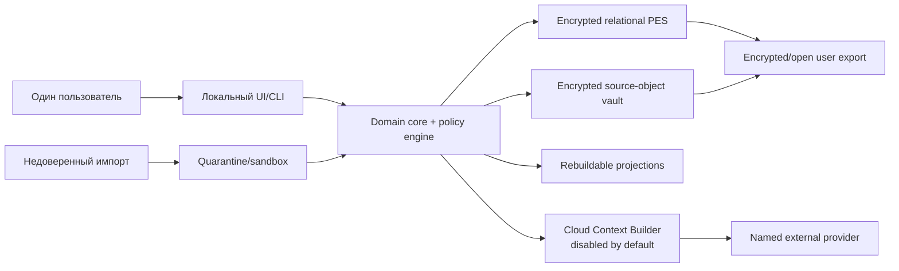

# PSYCHE OS v2 — независимая реконструкция от первых принципов

**Срез исследований:** 2026-08-10  
**Статус:** архитектурная реконструкция до конвергенции; не разрешение на production или реальные данные  
**Вход:** требования к пользе, эпистемике, безопасности, приватности и сроку жизни; research workstreams  
**Независимость:** архитектура v1 не использовалась как перечень модулей, таблиц, экранов или технологий  
**Данные:** только синтетические fixtures; `REAL_DATA_GATE = CLOSED`

## 1. Как обеспечивалась независимость

Реконструкция проводилась в следующем порядке:

1. Сначала сформулирована задача и недопустимые исходы без обращения к структуре v1.
2. Затем из исследований выведены различия, которые нельзя безвозвратно смешивать: источник и интерпретация; сообщение и факт; наблюдение и гипотеза; состояние и черта; популяционная и индивидуальная оценка; содержание и политика обработки; произошедшее, наблюдённое, сообщённое, записанное и утверждённое время.
3. После этого определены операции жизненного цикла данных и отказные сценарии.
4. Спроектированы четыре материально разные архитектуры. Ни одна не считалась предпочтительной до одинакового сравнения и kill-tests.
5. Только после выбора независимый результат сопоставлен с улучшенными идеями v1 из критического аудита.

Этот документ не доказывает клиническую валидность продукта. Он показывает, какая минимальная архитектура не противоречит найденным ограничениям и оставляет спорные возможности обратимыми.

## 2. Problem framing от первых принципов

### 2.1. Реальная задача

Пользователю нужен не «цифровой двойник» и не машина, которая сообщает, кто он. Нужен личный, долгоживущий инструмент, который помогает:

- сохранить выбранные человеком источники и рассказы без подмены их более поздней интерпретацией;
- найти материал спустя годы и понять, откуда взялся каждый вывод;
- различить наблюдение, измерение, сообщение, память, чужое утверждение, классификационное отображение и гипотезу;
- сравнить альтернативные объяснения, противоречия и неизвестное;
- исправить, отозвать, удалить и экспортировать данные без зависимости от одного AI-провайдера;
- при явной цели проводить ограниченные повторные измерения или низкорисковые N-of-1 наблюдения, не превращая корреляции в причины;
- получить полезную рефлексию, не подменяющую клинициста, отношения или собственное решение.

Клиническая феноменология требует сохранять контекст и исходные слова отдельно от нормализации [CLIN-001]. ICD/DSM, RDoC/HiTOP и личностные модели являются разными отображениями с разными целями, а не одной онтологией человека [CLIN-002, CLIN-006, CLIN-007, CLIN-010]. Память реконструктивна; уверенность и яркость не доказывают историческую точность [CLIN-024, CLIN-025, CLIN-027]. Функционирование и качество жизни нельзя свести к наличию симптомов [CLIN-037, CLIN-038, CLIN-039, CLIN-040].

### 2.2. Что является успехом

Успех — не максимальное число записей, сессий, вопросов или AI-ответов. Система успешна, если пользователь способен:

- быстро найти первичный материал и увидеть его provenance;
- понять статус и предел каждого вывода;
- обнаружить противоречие или пропуск, не получив ложной «целостности»;
- безопасно прекратить использование на месяцы или годы и вернуться без наказания;
- получить проверяемый переносимый архив;
- удалить выбранный материал и его реконструирующие производные;
- пользоваться основным архивом при полном отключении AI и сети.

Исследования self-tracking показывают одновременно возможную пользу, burden и отказ от систем; engagement не равен wellbeing [ARCH-049, ARCH-050, ARCH-051, ARCH-052, ARCH-053]. Поэтому обязательное ежедневное ведение и удержание пользователя исключены из целевой функции.

### 2.3. Недопустимые исходы

Система считается провалившейся, если хотя бы один из следующих исходов становится нормальным режимом:

- AI-вывод превращается в канонический факт или диагноз;
- текущая память превращается в подтверждённое событие;
- screening score воспринимается как диагноз или персональная сущность;
- невалидированный перевод, норма или wearable metric получает вид научной точности;
- `NEVER_CLOUD`-содержание или его реконструирующая производная попадает в сетевой клиент;
- пользователь не может проверить, исправить, удалить или экспортировать запись;
- утрата устройства или системного профиля делает единственный архив невосстановимым;
- импортированный документ меняет инструкции, политику или инициирует действие;
- прекращение ежедневного ввода разрушает ценность архива;
- через смену схемы, провайдера или приложения данные становятся семантически непонятны.

### 2.4. Пользователи и границы ролей

Основной субъект и оператор — один взрослый пользователь. Другие люди, упомянутые в источниках, являются третьими лицами, а не автоматически разрешёнными субъектами анализа. AI — вычислительный поставщик предложений. Клиницист, исследователь, доверенное лицо и аварийный контакт не получают доступа или обязанностей без отдельного будущего контракта. Продукт не обещает мониторинг, спасение, конфиденциальность уровня лицензированного специалиста или клиническое решение [CLIN-046, CLIN-047, CLIN-048, CLIN-049, CLIN-050; ARCH-012, ARCH-013, ARCH-014, ARCH-015].

## 3. Жёсткие ограничения, выведенные до выбора архитектуры

| ID | Инвариант | Почему он первичен | Проверяемое следствие |
|---|---|---|---|
| IR-01 | `RAW/VERBATIM != NORMALIZED != DERIVED` | Позднее разделение не восстановит утраченное происхождение | Разные сущности, ссылки derivation и UI-маркировка |
| IR-02 | `LLM_OUTPUT = PROPOSAL_ONLY` | Правдоподобность текста не является evidence | Нет прямой канонической записи из model adapter |
| IR-03 | `REPORT/MEMORY != HISTORICAL_FACT` | Память реконструктивна и подвержена suggestion | `EventCandidate`, source monitoring, competing temporal assertions |
| IR-04 | `SCREENING != DIAGNOSIS` | Валидность зависит от цели, выборки, языка и процесса | Registry-gated measurement; диагностический вывод запрещён |
| IR-05 | `ASSOCIATION != CAUSATION` | N=1, autocorrelation, missingness и confounding искажают вывод | Тип causality/estimand и ограниченный словарь вывода |
| IR-06 | `CONTENT_POLICY` наследуется по lineage | Производная может раскрыть исходник | Egress до prompt/network; most-restrictive-parent default |
| IR-07 | Исправление, supersession и deletion различны | Аудит и автономия требуют разных операций | Версии, причины, dependency invalidation, deletion receipt |
| IR-08 | Время многомерно и может быть нечётким | Один timestamp фабрикует порядок и точность | occurred/observed/reported/recorded/asserted + bounds/precision |
| IR-09 | Каноническая польза не зависит от AI | Модели исчезают и меняются | Полный read/write/export без provider adapter |
| IR-10 | Recovery является частью encryption | Шифрование без восстановления создаёт риск потери | Два независимых key-wrap пути и restore drills |
| IR-11 | Импорт — недоверенный ввод | Файлы несут parser exploits и prompt injection | Quarantine, limits, sandbox, inert rendering, preview |
| IR-12 | Схема и научное знание версионируются отдельно | Наука меняется быстрее базовых сущностей | Stable primitives + versioned registries/snapshots |
| IR-13 | Burden — ограниченный ресурс | Больше данных может ухудшать качество и wellbeing | Нет cadence по умолчанию; stop/skip; adaptive reduction |
| IR-14 | Hard deletion может намеренно ломать воспроизводимость | Право удалить важнее полноты истории | Никакого скрытого payload в audit; projections перестраиваются |
| IR-15 | Реальные данные требуют отдельного допуска | Документ не доказывает безопасность реализации | Gate остаётся закрыт до тестов crypto/restore/delete/export/import |

## 4. Необходимые операции жизненного цикла

Архитектура должна поддерживать операции, а не только статические сущности:

1. `capture`: принять локальный ручной ввод или файл в quarantine, назначить opaque ID и политику до анализа;
2. `preserve`: сохранить допустимый источник, метаданные происхождения и минимально необходимый verbatim;
3. `normalize`: детерминированно или через proposal создать отдельное нормализованное утверждение;
4. `derive`: создать typed claim/hypothesis с входами, версией метода, альтернативами и сроком review;
5. `measure`: применить только зарегистрированный instrument/version/language/rights/scoring contract;
6. `inspect`: пройти от вывода к evidence и обратно;
7. `contradict`: хранить несовместимые assertions без принудительного выбора;
8. `correct/supersede`: создать новую версию и сохранить причину, не редактируя источник задним числом;
9. `delete`: найти lineage, удалить payload и реконструирующие производные, перестроить индексы, выдать безсодержательный receipt;
10. `export`: сформировать открытый manifest/schema/data/human-readable пакет;
11. `backup/restore`: создать зашифрованную копию и доказать синтетическим восстановлением;
12. `migrate/rebuild`: обновить canonical schema и полностью пересоздать search/graph/vector/report projections;
13. `egress`: построить минимальный cloud context только после локальной политики и показать preview/receipt;
14. `pause/resume`: сохранить ценность архива без серии, streak и штрафа за пробел.

## 5. Четыре конкурирующие архитектуры

### 5.1. Кандидат A — state-relational modular monolith

Каноническое состояние хранится в нормализованных relational tables. История реализуется локальными version tables только там, где явно требуется. Бинарные источники лежат рядом как зашифрованные blobs. Поиск и отчёты выполняются напрямую из состояния.

**Сильные стороны:** простые запросы и транзакции; низкая начальная сложность; понятное hard deletion; хороший offline-профиль.  
**Слабые стороны:** неоднородная история изменений; риск, что provenance и temporal semantics будут добавлены выборочно; аудит и реконструкция «как система знала это тогда» быстро становятся специальными случаями.

**Kill-test:** восстановить прежнее состояние сложного claim после нескольких corrections, смены registry snapshot и удаления одного входа. Наивная версия кандидата тест не проходит без превращения почти каждой таблицы в отдельно спроектированную temporal/versioned структуру.

### 5.2. Кандидат B — полный event-sourced temporal ledger

Каждое действие записывается как неизменяемое событие; текущее состояние и все views пересобираются из журнала. Источники и AI-runs также представлены событиями. Исправление — компенсирующее событие.

**Сильные стороны:** подробный audit trail; естественный historical replay; явная последовательность решений.  
**Слабые стороны:** payload размножается в журнале; erasure требует криптографической редактируемости, tombstone/compaction или нарушения основного принципа; schema evolution усложняет replay; portable export требует переносить event semantics и reducers; corruption раннего события отравляет все проекции.

**Kill-test:** гарантированно удалить чувствительный фрагмент из канона, истории, производных и backups, сохранив полезный audit без содержания. Полный event sourcing тест не проходит без сложного redaction/compaction режима, который делает журнал не полностью immutable и сохраняет высокий риск реконструкции.

### 5.3. Кандидат C — canonical document/graph evidence fabric

Каноническими являются immutable JSON-документы или graph nodes/edges, адресуемые по содержанию. Claims, evidence, persons, events и model snapshots связаны typed edges; graph query является основным способом работы. Новые версии добавляются рядом.

**Сильные стороны:** выразительная provenance/argument структура; удобная эволюция sparse-документов; естественная визуализация связей.  
**Слабые стороны:** граф визуально реифицирует гипотетические связи; глобальные relational invariants и multi-record deletion труднее; content hashes раскрывают equality/known-content membership; долгосрочная переносимость зависит от graph engine/query dialect; bitemporal и fuzzy-time запросы становятся сложными.

**Kill-test:** экспортировать архив в открытом формате, затем на чистой реализации доказать все uniqueness, lineage, deletion и temporal invariants без исходного graph engine. Кандидат возможен, но цена portability и integrity выше пользы graph-native канона.

### 5.4. Кандидат D — hybrid bitemporal relational core + encrypted artifacts + metadata audit + projections

Каноническим является локальный relational Personal Evidence Store. Источники хранятся как зашифрованные объекты с opaque IDs. Смысловые записи имеют явные версии, entity-specific temporal fields и typed derivation/evidence relations. Append-only audit содержит только необходимые операционные факты и не дублирует удаляемый payload. Full-text, graph, vector, columnar analytics и отчёты — полностью пересоздаваемые projections.

**Сильные стороны:** транзакционные invariants; queryability; явная история; переносимый канон; контролируемая deletion lineage; деградация без AI/graph/vector; возможность оптимизировать projections отдельно.  
**Слабые стороны:** труднее наивного CRUD; нельзя «бесплатно» получить полный replay; нужно строго удерживать границу canonical/projection; hard deletion сознательно разрушает часть воспроизводимости.

**Kill-test:** удалить один source, инвалидировать зависимые claims/embeddings/reports, сохранить несодержательный receipt, экспортировать оставшийся архив и восстановить его без AI. Кандидат проходит при условии, что lineage и политики являются canonical, а audit запрещено хранить payload.

## 6. Сравнение до выбора

Шкала 1–5 — инженерная deliberation rubric, а не эмпирическая метрика. Она используется только для явного сопоставления под заданные single-user, local-first, high-sensitivity условия. Равные баллы не означают научной эквивалентности.

| Критерий | Вес | A State-relational | B Full event sourcing | C Document/graph canonical | D Hybrid core |
|---|---:|---:|---:|---:|---:|
| Эпистемическая трассируемость | 5 | 3 | 4 | 4 | 5 |
| Hard deletion и lineage cleanup | 5 | 4 | 1 | 2 | 4 |
| Privacy blast-radius control | 5 | 4 | 2 | 2 | 5 |
| Lifetime durability/semantic survival | 5 | 3 | 2 | 2 | 5 |
| Queryability без replay | 4 | 5 | 2 | 4 | 5 |
| Auditability/history views | 4 | 3 | 5 | 4 | 5 |
| Schema evolution/migrations | 4 | 3 | 2 | 3 | 4 |
| Portable open export | 4 | 4 | 2 | 2 | 5 |
| Graceful degradation | 4 | 4 | 2 | 3 | 5 |
| Простота реализации/recovery | 3 | 5 | 1 | 2 | 3 |
| Производительность для одного пользователя | 2 | 5 | 3 | 3 | 4 |
| **Взвешенный итог / 225** |  | **171** | **106** | **126** | **208** |

### 6.1. Sensitivity check

- Если audit/replay получает максимальный приоритет, B выигрывает только одну ось, но остаётся неприемлемым по deletion, portability и migration.
- Если минимальная F0-сложность важнее истории, A становится разумным прототипом, но его необходимо усилить versioning/lineage настолько, что он приближается к D.
- Если основной продукт — исследование graph traversal, C становится конкурентным; это не исходная задача личного приватного архива.
- D сохраняет преимущество при удалении performance и простоты реализации из оценки; выбор не держится на одном субъективном весе.

### 6.2. Решение

Выбран **кандидат D**. Решение обусловлено не модой на конкретную БД, а сочетанием взаимоисключающих требований: provenance и historical views; hard deletion; open export; offline usefulness; policy lineage; долговечность; отсутствие обязательного replay. Концепции provenance и portable schemas поддерживают явные entity/activity/agent relations и versioned machine-readable records [ARCH-041, ARCH-042, ARCH-043]. BagIt-подобный manifest полезен для инвентаря и проверки целостности, но не является security boundary [ARCH-046]. Long-term формат должен иметь открытое описание и human-readable companion [ARCH-047]. Temporal database principles полезны, но домен требует более богатых часов и fuzzy intervals [ARCH-048].

## 7. Независимо выведенная целевая архитектура

### 7.1. Контекст и trust boundaries

Canonical DB и object vault находятся внутри vault boundary. Quarantine не получает master key или неограниченную сеть. Projection workers имеют чтение только минимально необходимого набора и могут быть полностью удалены. Network adapter не видит данные до локального policy/lineage решения. Provider-side history, files, memories и vector stores не считаются persistence системы [ARCH-039, ARCH-040].

### 7.2. Минимальные конституционные примитивы

Это не финальный перечень таблиц. Это семантические типы, потеря которых необратимо разрушит смысл:

- `VaultIdentity`, `Party`, `SubjectScope`;
- `Source`, `Artifact`, `Report`, `MemoryAccount`;
- `Assertion`, `Observation`, `MeasurementResult`, `EventCandidate`;
- `TemporalAssertion` с bounds, precision и basis;
- `Claim`, `EvidenceLink`, `Contradiction`, `Unknown/CoverageAssessment`;
- `DerivationRun`, `GenerationProposal`, `HumanDecision`;
- `DataPolicy`, `ConsentOrAuthority`, `ThirdPartyScope`, `RetentionRule`;
- `Correction`, `Supersession`, `DeletionOperation`;
- `RegistrySnapshot`, `KnowledgeSnapshot`, `SchemaVersion`;
- `PersonalModelSnapshot` как derived manifest, а не сущность человека.

Phenomenology, functioning, classification, research dimensions, traits, states, developmental hypotheses и thriving остаются раздельными проекциями/claim types [CLIN-001–CLIN-018, CLIN-037–CLIN-041]. Их таксономии версионируются и не становятся жёсткими колонками «истинного портрета».

### 7.3. Canonical writes

Есть только три класса записи:

1. **Детерминированный capture** — пользовательский ввод, import metadata, timestamps, policy и byte-preserving source после quarantine.
2. **Детерминированный transform** — проверенная schema migration, scoring или parser transform с зарегистрированной версией.
3. **Derived proposal** — нормализация, link, summary, hypothesis или question, предложенные AI/эвристикой. Proposal сохраняется отдельно и становится принятым derived record только после policy, provenance, evidence, contradiction и human-decision checks.

Даже принятый proposal не превращается в source evidence. Model-run сохраняет provider/model identifier, prompt/template hash, parameters, input IDs, code/schema/knowledge snapshot, output hash и known reproducibility limits; sensitive prompt text не дублируется в журнале.

### 7.4. Scientific and measurement boundary

- Каждый instrument имеет context of use, version, language, rights, population/norm, exact scoring/missingness rules и allowed interpretations [MEAS-001, MEAS-002, MEAS-003, MEAS-004, MEAS-005, MEAS-006, MEAS-007, MEAS-008, MEAS-009, MEAS-010, MEAS-011].
- Scoring выполняется детерминированно; LLM может объяснить уже рассчитанный результат, но не считать балл и не изобретать item.
- Normative и idiographic estimands никогда не смешиваются. Repeated score не объявляется change без measurement error/responsiveness/comparability.
- Любая временная аналитика хранит coverage, missingness, autocorrelation/lag assumptions, multiplicity family, planned/exploratory status и concurrent changes [MEAS-032, MEAS-033, MEAS-034, MEAS-035, MEAS-036, MEAS-037].
- Causal language ограничивается дизайном; N-of-1 имеет preregistered question, outcome, baseline, phase/randomization, washout, harms и stop rules [MEAS-038, MEAS-039, MEAS-040, MEAS-041, MEAS-042, MEAS-043].
- Medication, substance, dangerous sleep restriction, trauma exposure, self-harm и иные high-risk autonomous experiments запрещены.

### 7.5. Privacy, keys and recovery

Data policy — набор ортогональных полей, а не одна метка: sensitivity, local/cloud rule, named purpose/provider, third-party scope, retention, export/redaction и lineage rule. `NEVER_CLOUD` наследуется реконструирующими derivatives. Consent не отменяет minimization [ARCH-004, ARCH-005, ARCH-016, ARCH-017].

Encryption envelope:

1. случайный vault master key;
2. domain-separated database/blob/manifest keys;
3. SQLCipher-compatible encrypted relational store и per-blob versioned AEAD с уникальными nonce [ARCH-020, ARCH-021, ARCH-023, ARCH-026];
4. convenience wrap через OS keystore [ARCH-024, ARCH-025];
5. независимый recovery wrap через user-held secret и Argon2id с benchmarked parameters [ARCH-022];
6. authenticated algorithm/key-version metadata, rotation и retirement;
7. encrypted backup до выхода за boundary и регулярный synthetic restore.

Plaintext hashes не являются именами файлов; используются opaque IDs, а equality/integrity digests хранятся encrypted/keyed. WAL, temp, thumbnails, logs, crash dumps, clipboard и search indexes входят в data-flow review [ARCH-027, ARCH-028, ARCH-029, ARCH-030].

### 7.6. Import and model boundary

Pipeline: `intake → quarantine → type/size/signature/archive limits → isolated parse/extract → provenance → inert preview → explicit commit`. Ссылки не загружаются автоматически. Текст «ignore previous instructions» сохраняется как цитируемое содержание. Parser/renderer не имеет vault keys и unrestricted network. Model output не выполняет tools и не меняет policy напрямую. Эти ограничения нужны, потому что prompt injection не решается одним системным prompt [ARCH-031, ARCH-032, ARCH-033, ARCH-034, ARCH-035, ARCH-036].

### 7.7. Correction, supersession and deletion

- **Correction** добавляет исправленное утверждение и объяснение, сохраняя источник, если пользователь не запросил deletion.
- **Supersession** завершает период актуальности версии; старая версия остаётся доступной в пределах retention/policy.
- **Deletion** удаляет выбранный payload и идентифицированные reconstructive descendants, удаляет/перестраивает search, graph, vector, thumbnails, summaries, reports и caches.
- Audit после deletion сохраняет только operation ID, scope category, time, outcome и неидентифицирующую ошибку; он не содержит title, excerpt, hash исходного plaintext или model prompt.
- Backups подчиняются заявленному expiry/rotation и crypto-erasure; уже экспортированные или раскрытые третьей стороне копии не обещаются как удалённые.
- После deletion зависимый claim получает `invalidated_due_to_missing_input` или удаляется согласно политике; UI не показывает его как действующий.

### 7.8. UX, который выдерживает пробелы

Первичные поверхности: `Capture`, `Timeline`, `Explore`, `Reviews`, `Data & Privacy`. Chat — временная поверхность запроса/композиции, а не архив. Каждый вопрос объясняет цель; допускаются `unknown`, `not now`, `skip`, `stop`. Нет streak, completion percentage «модели себя», ежедневного режима по умолчанию или engagement target. Система предлагает episodic capture, retrieval/correction value после малой порции ввода и автоматическое снижение cadence при burden/reactivity [ARCH-049–ARCH-053; MEAS-022, MEAS-023, MEAS-024, MEAS-025, MEAS-026, MEAS-027].

### 7.9. Архив на 1, 5, 20 и 40 лет

- **1 год:** schema migrations обратимы на synthetic snapshot; integrations отключаемы; projections rebuildable; restore drill автоматизирован.
- **5 лет:** каждый scientific/provider/instrument snapshot имеет review/supersession; deprecated adapter не блокирует canonical read/export.
- **20 лет:** сохраняются schema docs, migration ledger, старые readers или documented transform, open JSON/JSONL + schema + manifest + Markdown export; encrypted SQLite preservation snapshot опционален.
- **40 лет:** human-readable semantics и provenance важнее существования исходного приложения; cryptographic algorithms и key wrapping имеют migration plan; пользователь контролирует recovery/succession decision и может создать redacted portable archive.

FHIR mappings допускаются только как clinician-interchange projections, не canonical model [ARCH-044, ARCH-045]. Graph/vector/Parquet являются disposable outputs. Долгоживущая система хранит данные и смысл преобразований, а не обещание воспроизвести закрытую модель бит-в-бит.

## 8. Evidence trails для load-bearing решений

| Решение | Research question | Sources | Findings | Рассмотренные альтернативы | Final rationale |
|---|---|---|---|---|---|
| Personal Evidence Store, не digital twin | Может ли система моделировать человека без reification? | CLIN-001, CLIN-010, CLIN-016–CLIN-018, CLIN-046–CLIN-050 | Теории контекстны; AI склонен к overclaim/dependence; narrative меняется | Twin; diagnostic profile; notebook | Evidence/reflection framing ограничивает authority и сохраняет revisions |
| Hybrid canonical storage | Как совместить history, query, deletion и portability? | ARCH-041–ARCH-048 | Provenance, schemas, canonicalization, archival manifests и temporal semantics совместимы с typed relational core | A/B/C/D | D единственный проходит все kill-tests без специализированного engine lock-in |
| LLM proposal-only | Может ли model output быть evidence/write authority? | CLIN-046–CLIN-050; ARCH-012–ARCH-015, ARCH-031–ARCH-032 | Hallucination, sycophancy, injection и provider drift остаются | Direct writes; reviewer-only gate; no AI | Typed proposals дают полезность, но не смешивают generation с evidence |
| Orthogonal privacy + lineage | Достаточна ли одна privacy class? | ARCH-004–ARCH-005, ARCH-016–ARCH-017, ARCH-039–ARCH-040 | Purpose, destination, retention и third-party status независимы; provider policy меняется | P ladder; per-folder ACL; orthogonal policy | Машиноисполняемая policy и most-restrictive lineage закрывают производные |
| Dual-wrapped envelope | Как совместить at-rest safety и recovery? | ARCH-020–ARCH-026 | OS binding удобен, но может потеряться; password-only слаб по UX; AEAD/key lifecycle обязательны | OS-only; password-only; no app crypto | Random master + OS convenience + independent recovery минимизирует две разные катастрофы |
| Event/episodic capture | Нужно ли ежедневное заполнение? | ARCH-049–ARCH-053; MEAS-022–MEAS-027 | Burden/reactivity/attrition зависят от протокола; больше engagement не равно пользе | Daily pulse; fixed waves; passive sensing | User-chosen, purpose-bound, graceful-gap режим уменьшает вред и поддерживает десятилетия |
| Deterministic measurement gate | Достаточно ли воспроизводимого score? | MEAS-001–MEAS-011 | Validity относится к интерпретации/context; translation, rights и invariance load-bearing | LLM scoring; generic scale store; registry | Registry-gated engine не путает правильную арифметику с валидным выводом |
| Conservative longitudinal inference | Когда личные данные поддерживают association/causality? | MEAS-032–MEAS-043 | Within-person != between-person; missingness, autocorrelation, multiplicity и design определяют предел | Dashboard correlations; black-box prediction; causal ladder | Typed estimand/causality и protocol gate делают ограничения исполнимыми |
| Anti-suggestive memory model | Может ли система реконструировать биографию? | CLIN-024–CLIN-027 | Source-monitoring errors и retrospective disagreement неизбежны; leading questions вредят | Event truth table; confidence score; recovered-memory workflow | Reports/memory/event candidates/anchors разделены; alternatives и uncertainty сохраняются |
| Imports as hostile data | Может ли документ управлять AI или core? | ARCH-031–ARCH-036 | Indirect prompt injection и parser/browser risks не устраняются prompting | Direct ingest; trust by MIME; model tool use | Quarantine, least privilege и inert preview уменьшают и cyber-, и epistemic attack surface |

## 9. Сопоставление с улучшенной v1 только после выбора

### 9.1. Что независимо совпало и сохраняется

- local-first single-user posture;
- raw/derived separation, provenance, uncertainty, contradiction и unknown;
- memory humility, screening/diagnosis и correlation/causation boundaries;
- deterministic psychometrics отдельно от LLM;
- `NEVER_CLOUD`, provider independence, hard deletion и export;
- versioned personal model snapshots и research snapshots;
- no-real-data gate.

Совпадение не доказывает, что детали v1 верны; оно показывает, что несколько её принципов повторно выводятся из независимых рисков.

### 9.2. Что удалено

- «цифровой двойник»/полный mental model как продуктовая истина;
- единый p-score, общий wellness score и универсальная completeness metric;
- recovered-memory, hidden-trauma и детерминированная childhood causality;
- daily-use/streak/фиксированный большой intake как норма;
- direct LLM writes и autonomous treatment/clinical decision;
- full event sourcing личного payload;
- graph/vector/provider state как канон;
- one-dimensional privacy ladder;
- обязательный network listener в фундаменте.

### 9.3. Что добавлено

- explicit trust boundaries и import quarantine;
- dual-wrapped encryption/recovery envelope;
- orthogonal policy + reconstructive-lineage egress;
- entity-specific multi-clock/fuzzy temporal model;
- deletion dependency operation и non-content receipt;
- instrument rights/language/context registry;
- typed estimand/causality/N-of-1 risk contracts;
- archival manifest, schema readers, projection rebuild и decade checkpoints;
- burden budget и graceful-gap UX.

### 9.4. Что радикально изменено

- «evidence graph» стал Personal Evidence Store; graph — проекция;
- линейная лестница evidence стала typed derivation/evidence DAG;
- «event» стал uncertain `EventCandidate` с несколькими temporal assertions;
- personal model стал versioned derived snapshot с inspectable claims;
- append-only история ограничена non-content audit, а не всем payload;
- broad clinical ontology стала versioned routing/domain registry над theory-light primitives;
- cloud «режим» стал per-operation context contract с policy snapshot и receipt.

### 9.5. Что остаётся неопределённым

- конкретная cross-platform поставка и лицензирование SQLCipher;
- recovery/succession UX, устойчивый к потере и coercion;
- граница reconstructive derivative для сложных summaries;
- минимальные данные для каждого idiographic estimand;
- права и русскоязычная валидность конкретных instruments;
- эффективность automated mental-health safeguards;
- будущая регуляторная квалификация при изменении intended use;
- оптимальный UI evidence explorer и допустимый burden для разных пользователей.

Каждая неопределённость остаётся review trigger, а не скрытым обещанием.

## 10. Minimal irreversible core

**Freeze в F0:** идентичность vault; opaque IDs; raw/normalized/derived split; provenance/derivation; multi-clock/fuzzy time; policy/lineage; envelope/key/recovery contract; versions/correction/supersession/deletion; schema/migration/export manifest; non-content audit; synthetic test fixtures.

**Можно мигрировать:** конкретный relational mapping за narrow storage port, UI shell, report templates, search engine, knowledge retrieval implementation.

**Безопасно отложить:** cloud AI; graph/vector; passive sensing; messaging/calendar/browser imports; clinician mode; interventions; rich desktop; multi-agent orchestration.

## 11. Условия перехода к реализации

Разрешён только F0 constitutional foundation по отдельному точному implementation contract. Реальные данные остаются запрещены, пока автоматическими и ручными synthetic checks не доказаны:

- DB/blob/export/backup encryption и отсутствие plaintext temp/log/crash paths;
- unlock, wrong-key, key-loss, rotation, restore и corruption behavior;
- import quarantine, archive limits, parser isolation и prompt-injection invariants;
- `NEVER_CLOUD` lineage до network layer и egress receipts;
- correction/supersession/deletion cascade, projection rebuild и backup expiry;
- schema migration round-trip, rollback/dry-run, integrity and open export restore;
- deny-by-default instrument rights и отсутствие copyrighted items;
- no diagnosis/direct LLM writes/high-risk interventions;
- secret/personal-data Git guards и synthetic-only repository scan.

До выполнения этих условий итог независимой реконструкции: **архитектурная конвергенция возможна; production readiness — нет; `REAL_DATA_GATE = CLOSED`.**
